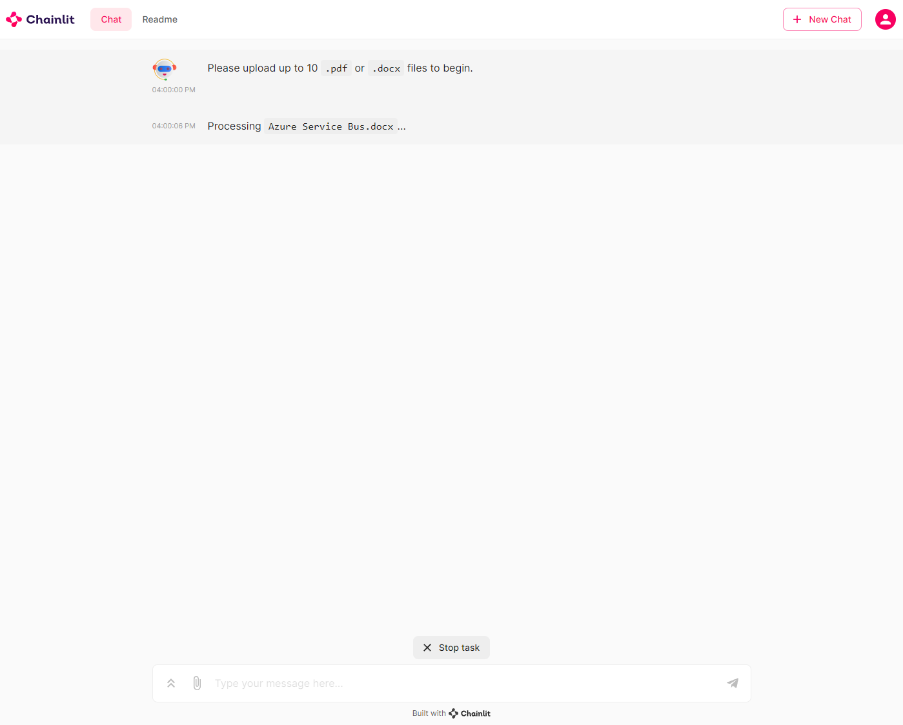
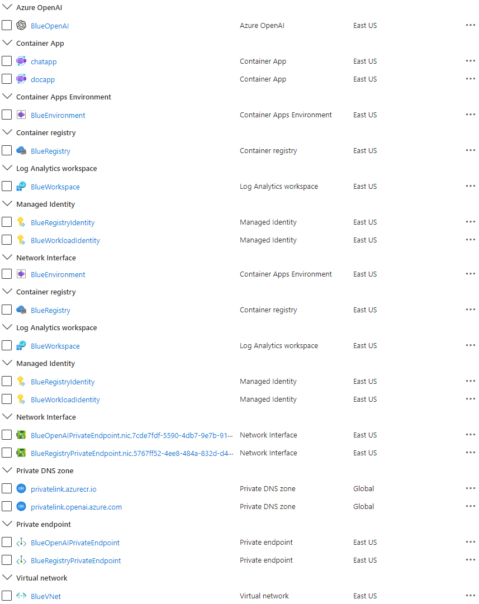

# Create an Azure OpenAI, LangChain, ChromaDB, and Chainlit ChatGPT-like application in Azure Container Apps using Terraform

In this sample, I demonstrate how to quickly build chat applications using [Python](https://www.python.org/) and leveraging powerful technologies such as [OpenAI ChatGPT models](https://platform.openai.com/docs/guides/gpt), [Embedding models](https://learn.microsoft.com/en-us/azure/ai-services/openai/concepts/models#embeddings-models), [LangChain](https://python.langchain.com/docs/get_started/introduction.html) framework, [ChromaDB](https://docs.trychroma.com/) vector database, and [Chainlit](https://docs.chainlit.io/overview), an open-source Python package that is specifically designed to create user interfaces (UIs) for AI applications. These applications are hosted on [Azure Container Apps](https://learn.microsoft.com/en-us/azure/container-apps/overview), a fully managed environment that enables you to run microservices and containerized applications on a serverless platform.

- **Simple Chat**: This simple chat application utilizes OpenAI's language models to generate real-time completion responses.
- **Documents QA Chat**: This chat application goes beyond simple conversations. Users can upload up to 10 `.pdf` and `.docx` documents, which are then processed to create vector embeddings. These embeddings are stored in [ChromaDB](https://docs.trychroma.com/) for efficient retrieval. Users can pose questions about the uploaded documents and view the [Chain of Thought](https://docs.chainlit.io/concepts/chain-of-thought),  enabling easy exploration of the reasoning process. The completion message contains links to the text chunks in the documents that were used as a source for the response.

Both applications use a [user-defined managed identity](https://learn.microsoft.com/en-us/azure/active-directory/managed-identities-azure-resources/overview) to authenticate and authorize against [Azure OpenAI Service (AOAI)](https://learn.microsoft.com/en-us/azure/ai-services/openai/overview) and [Azure Container Registry (ACR)](https://learn.microsoft.com/en-us/azure/container-registry/) and use [Azure Private Endpoints](https://learn.microsoft.com/en-us/azure/private-link/private-endpoint-overview) to connect privately and securely to these services. The chat UIs are built using [Chainlit](https://docs.chainlit.io/overview), an open-source Python package designed explicitly for creating AI applications. Chainlit seamlessly integrates with [LangChain](https://python.langchain.com/docs/get_started/introduction.html), [LlamaIndex](https://gpt-index.readthedocs.io/en/latest/), and [LangFlow](https://github.com/logspace-ai/langflow), making it a powerful tool for developing ChatGPT-like applications with ease.

By following our example, you can quickly create sophisticated chat applications that utilize cutting-edge technologies, empowering users with intelligent conversational capabilities.

## Prerequisites

- An active [Azure subscription](https://docs.microsoft.com/en-us/azure/guides/developer/azure-developer-guide#understanding-accounts-subscriptions-and-billing). If you don't have one, create a [free Azure account](https://azure.microsoft.com/free/) before you begin.
- [Visual Studio Code](https://code.visualstudio.com/) installed on one of the [supported platforms](https://code.visualstudio.com/docs/supporting/requirements#_platforms) along with the [HashiCorp Terraform](https://marketplace.visualstudio.com/items?itemName=HashiCorp.terraform).
- Azure CLI version 2.49.0 or later installed. To install or upgrade, see [Install Azure CLI](https://learn.microsoft.com/en-us/cli/azure/install-azure-cli).
- `aks-preview` Azure CLI extension of version 0.5.140 or later installed
- [Terraform v1.5.2 or later](https://developer.hashicorp.com/terraform/downloads).

## Architecture

The following diagram shows the architecture and network topology of the sample:


This sample provides two sets of Terraform modules to deploy the infrastructure and the chat applications. 

## Infrastructure Terraform Modules

You can use the Terraform modules in the `terraform/infra` folder to deploy the infrastructure used by the sample, including the [Azure Container Apps Environment](https://learn.microsoft.com/en-us/azure/container-apps/environment), [Azure OpenAI Service (AOAI)](https://learn.microsoft.com/en-us/azure/ai-services/openai/overview), and [Azure Container Registry (ACR)](https://learn.microsoft.com/en-us/azure/container-registry/container-registry-intro), but not the [Azure Container Apps (ACA)](https://learn.microsoft.com/en-us/azure/container-apps/applications?tabs=azure-cli). The Terraform modules in the `terraform/infra` folder deploy the following resources:

- [azurerm_virtual_network](https://registry.terraform.io/providers/hashicorp/azurerm/latest/docs/resources/virtual_network.html): an [Azure Virtual Network](https://learn.microsoft.com/en-us/azure/virtual-network/virtual-networks-overview) with two subnets:
  - `ContainerApps`: this subnet hosts the [Azure Container Apps Environment](https://learn.microsoft.com/en-us/azure/container-apps/environment).
  - `PrivateEndpoints`: this subnet contains the [Azure Private Endpoints](https://docs.microsoft.com/en-us/azure/private-link/private-endpoint-overview) to the [Azure OpenAI Service (AOAI)](https://learn.microsoft.com/en-us/azure/cognitive-services/openai/overview) and [Azure Container Registry (ACR)](https://learn.microsoft.com/en-us/azure/container-registry/) resources.
- [azurerm_container_app_environment](https://registry.terraform.io/providers/hashicorp/azurerm/latest/docs/data-sources/container_app_environment): the [Azure Container Apps Environment](https://learn.microsoft.com/en-us/azure/container-apps/environment) hosting the [Azure Container Apps](https://learn.microsoft.com/en-us/azure/container-apps/overview).
- [azurerm_cognitive_account](https://registry.terraform.io/providers/hashicorp/azurerm/latest/docs/resources/cognitive_account): an [Azure OpenAI Service (AOAI)](https://learn.microsoft.com/en-us/azure/cognitive-services/openai/overview) with a [GPT-3.5](https://learn.microsoft.com/en-us/azure/cognitive-services/openai/concepts/models#chatgpt-gpt-35-turbo) model used by the chatbot applications. Azure OpenAI Service gives customers advanced language AI with OpenAI GPT-4, GPT-3, Codex, and DALL-E models with Azure's security and enterprise promise. Azure OpenAI co-develops the APIs with OpenAI, ensuring compatibility and a smooth transition from one to the other. The Terraform modules create the following models:
  - [GPT-35](https://learn.microsoft.com/en-us/azure/ai-services/openai/concepts/models#gpt-35): a `gpt-35-turbo-16k` model is used to generate human-like and engaging conversational responses.
  - [Embeddings model](https://learn.microsoft.com/en-us/azure/ai-services/openai/concepts/models#embeddings-models): the `text-embedding-ada-002` model is to transform input documents into meaningful and compact numerical representations called embeddings. Embeddings capture the semantic or contextual information of the input data in a lower-dimensional space, making it easier for machine learning algorithms to process and analyze the data effectively. Embeddings can be stored in a vector database, such as [ChromaDB](https://docs.trychroma.com/) or [Facebook AI Similarity Search](https://faiss.ai/index.html), explicitly designed for efficient storage, indexing, and retrieval of vector embeddings.
- [azurerm_user_assigned_identity](https://registry.terraform.io/providers/hashicorp/azurerm/latest/docs/resources/user_assigned_identity): a [user-defined managed identity](https://learn.microsoft.com/en-us/azure/active-directory/managed-identities-azure-resources/overview) used by the chatbot applications to acquire a security token to call the [Chat Completion API](https://platform.openai.com/docs/api-reference/chat) of the [ChatGPT model](https://learn.microsoft.com/en-us/azure/cognitive-services/openai/concepts/models#chatgpt-gpt-35-turbo) provided by the [Azure OpenAI Service](https://learn.microsoft.com/en-us/azure/cognitive-services/openai/overview) and to call the [Embedding model](https://learn.microsoft.com/en-us/azure/ai-services/openai/concepts/models#embeddings-models).
- [azurerm_container_registry](https://registry.terraform.io/providers/hashicorp/azurerm/latest/docs/resources/container_registry): an [Azure Container Registry (ACR)](https://learn.microsoft.com/en-us/azure/container-registry/) to build, store, and manage container images and artifacts in a private registry for all container deployments. In this sample, the registry stores the container images of the two chat applications.
- [azurerm_private_endpoint](https://registry.terraform.io/providers/hashicorp/azurerm/latest/docs/resources/private_endpoint): an [Azure Private Endpoint](https://docs.microsoft.com/en-us/azure/private-link/private-endpoint-overview) is created for each of the following resources:
  - [Azure OpenAI Service (AOAI)](https://learn.microsoft.com/en-us/azure/cognitive-services/openai/overview)
  - [Azure Container Registry (ACR)](https://learn.microsoft.com/en-us/azure/container-registry/)
- [azurerm_private_dns_zone](https://registry.terraform.io/providers/hashicorp/azurerm/latest/docs/data-sources/private_dns_zone): an [Azure Private DNS Zone](https://docs.microsoft.com/en-us/azure/dns/private-dns-overview) is created for each of the following resources:
  - [Azure OpenAI Service (AOAI)](https://learn.microsoft.com/en-us/azure/cognitive-services/openai/overview)
  - [Azure Container Registry (ACR)](https://learn.microsoft.com/en-us/azure/container-registry/)
- [azurerm_log_analytics_workspace](https://registry.terraform.io/providers/hashicorp/azurerm/latest/docs/resources/log_analytics_workspace): a centralized [Azure Log Analytics](https://docs.microsoft.com/en-us/azure/azure-monitor/logs/log-analytics-workspace-overview) workspace is used to collect the diagnostics logs and metrics from all the Azure resources:
  - [Azure OpenAI Service (AOAI)](https://learn.microsoft.com/en-us/azure/cognitive-services/openai/overview)
  - [Azure Container Registry (ACR)](https://learn.microsoft.com/en-us/azure/container-registry/)
  - [Azure Container Apps (ACA)](https://learn.microsoft.com/en-us/azure/container-apps/overview)

## Application Terraform Modules

You can use these Terraform modules in the `terraform/apps` folder to deploy the [Azure Container Apps (ACA)](https://learn.microsoft.com/en-us/azure/container-apps/overview) using the Docker container images stored in the [Azure Container Registry](https://learn.microsoft.com/en-us/azure/container-registry/container-registry-intro) that you deployed at the previous step.

- [azurerm_container_app](https://registry.terraform.io/providers/hashicorp/azurerm/latest/docs/data-sources/container_app): this samples deploys the following applications:
  - **chatapp**: this simple chat application utilizes OpenAI's language models to generate real-time completion responses.
  - **docapp**: This chat application goes beyond conversations. Users can upload up to 10 `.pdf` and `.docx` documents, which are then processed to create vector embeddings. These embeddings are stored in ChromaDB for efficient retrieval. Users can pose questions about the uploaded documents and view the [Chain of Thought](https://docs.chainlit.io/concepts/chain-of-thought),  enabling easy exploration of the reasoning process. The completion message contains links to the text chunks in the documents that were used as a source for the response.

## Azure Container Apps

[Azure Container Apps (ACA)](https://learn.microsoft.com/en-us/azure/container-apps/overview) is a serverless compute service provided by Microsoft Azure that allows developers to easily deploy and manage containerized applications without the need to manage the underlying infrastructure. It provides a simplified and scalable solution for running applications in containers, leveraging the power and flexibility of the Azure ecosystem.

With Azure Container Apps, developers can package their applications into containers using popular containerization technologies such as [Docker](https://www.docker.com/). These containers encapsulate the application and its dependencies, ensuring consistent execution across different environments.

Powered by [Kubernetes](https://kubernetes.io/) and open-source technologies like [Dapr](https://dapr.io/), [KEDA](https://keda.sh/), and [envoy](https://www.envoyproxy.io/), the service abstracts away the complexities of managing the infrastructure, including provisioning, scaling, and monitoring, allowing developers to focus solely on building and deploying their applications. Azure Container Apps handles automatic scaling, and load balancing, and natively integrates with other Azure services, such as [Azure Monitor](https://learn.microsoft.com/en-us/azure/container-apps/observability) and [Azure Container Registry (ACR)](https://learn.microsoft.com/en-us/azure/container-registry/), to provide a comprehensive and secure application deployment experience.

Azure Container Apps offers benefits such as rapid deployment, easy scalability, cost-efficiency, and seamless integration with other Azure services, making it an attractive choice for modern application development and deployment scenarios.

## Azure OpenAI Service

The [Azure OpenAI Service](https://learn.microsoft.com/en-us/azure/cognitive-services/openai/overview) is a platform offered by Microsoft Azure that provides cognitive services powered by [OpenAI](https://openai.com/) models. One of the models available through this service is the [ChatGPT](https://learn.microsoft.com/en-us/azure/cognitive-services/openai/concepts/models#gpt-4-models) model, which is designed for interactive conversational tasks. It allows developers to integrate natural language understanding and generation capabilities into their applications.

Azure OpenAI Service provides REST API access to OpenAI's powerful language models including the [GPT-3](https://learn.microsoft.com/en-us/azure/cognitive-services/openai/concepts/models#gpt-3-models), [Codex](https://learn.microsoft.com/en-us/azure/cognitive-services/openai/concepts/models#codex-models) and [Embeddings](https://learn.microsoft.com/en-us/azure/cognitive-services/openai/concepts/models#codex-models) model series. In addition, the new [GPT-4](https://learn.microsoft.com/en-us/azure/cognitive-services/openai/concepts/models#gpt-4-models) and [ChatGPT](https://learn.microsoft.com/en-us/azure/cognitive-services/openai/concepts/models#chatgpt-gpt-35-turbo) model series have now reached general availability. These models can be easily adapted to your specific task, including but not limited to content generation, summarization, semantic search, and natural language-to-code translation. Users can access the service through REST APIs, Python SDK, or our web-based interface in the Azure OpenAI Studio.

You can use [Embeddings model](https://learn.microsoft.com/en-us/azure/ai-services/openai/concepts/models#embeddings-models) to transform raw data or inputs into meaningful and compact numerical representations called embeddings. Embeddings capture the semantic or contextual information of the input data in a lower-dimensional space, making it easier for machine learning algorithms to process and analyze the data effectively. Embeddings can be stored in a vector database, such as [ChromaDB](https://docs.trychroma.com/) or [Facebook AI Similarity Search (FAISS)](https://faiss.ai/index.html), designed specifically for efficient storage, indexing, and retrieval of vector embeddings.

The [Chat Completion API](https://platform.openai.com/docs/api-reference/chat/create), which is part of the Azure OpenAI Service, provides a dedicated interface for interacting with the [ChatGPT](https://learn.microsoft.com/en-us/azure/cognitive-services/openai/concepts/models#chatgpt-gpt-35-turbo) and [GPT-4 models](https://learn.microsoft.com/en-us/azure/cognitive-services/openai/concepts/models#gpt-4-models). This API is currently in preview and is the preferred method for accessing these models. The GPT-4 models can only be accessed through this API.

[GPT-3](https://learn.microsoft.com/en-us/azure/cognitive-services/openai/concepts/models#gpt-3-models), [GPT-3.5](https://learn.microsoft.com/en-us/azure/cognitive-services/openai/concepts/models#chatgpt-gpt-35-turbo), and [GPT-4](https://learn.microsoft.com/en-us/azure/cognitive-services/openai/concepts/models#gpt-4-models) models from OpenAI are prompt-based. With prompt-based models, the user interacts with the model by entering a text prompt, to which the model responds with a text completion. This completion is the model’s continuation of the input text. While these models are extremely powerful, their behavior is also very sensitive to the prompt. This makes prompt construction an important skill to develop. For more information, see [Introduction to prompt engineering](https://learn.microsoft.com/en-us/azure/cognitive-services/openai/concepts/prompt-engineering).

Prompt construction can be difficult. In practice, the prompt acts to configure the model weights to complete the desired task, but it's more of an art than a science, often requiring experience and intuition to craft a successful prompt. The goal of this article is to help get you started with this learning process. It attempts to capture general concepts and patterns that apply to all GPT models. However, it's essential to understand that each model behaves differently, so the learnings may not apply equally to all models.

Prompt engineering refers to the process of creating instructions called prompts for Large Language Models (LLMs), such as OpenAI’s ChatGPT. With the immense potential of LLMs to solve a wide range of tasks, leveraging prompt engineering can empower us to save significant time and facilitate the development of impressive applications. It holds the key to unleashing the full capabilities of these huge models, transforming how we interact and benefit from them. For more information, see [Prompt engineering techniques](https://learn.microsoft.com/en-us/azure/cognitive-services/openai/concepts/advanced-prompt-engineering?pivots=programming-language-chat-completions).

## Vector Databases

A [vector database](https://learn.microsoft.com/en-us/semantic-kernel/memories/vector-db) is a specialized database that goes beyond traditional storage by organizing information to simplify the search for similar items. Instead of merely storing words or numbers, it leverages vector embeddings - unique numerical representations of data. These embeddings capture meaning, context, and relationships. For instance, words are represented as vectors, whereas similar words have similar vector values.

The applications of vector databases are numerous and powerful. In language processing, they facilitate the discovery of related documents or sentences. By comparing the vector embeddings of different texts, finding similar or related information becomes faster and more efficient. This capability benefits search engines and recommendation systems, which can suggest relevant articles or products based on user interests.

In the realm of image analysis, vector databases excel in finding visually similar images. By representing images as vectors, a simple comparison of vector values can identify visually similar images. This capability is highly valuable for tasks like reverse image search or content-based image retrieval.

Additionally, vector databases find applications in fraud detection, anomaly detection, and clustering. By comparing vector embeddings of data points, unusual patterns can be detected, and similar items can be grouped together, aiding in effective data analysis and decision-making.

Here is a list of the most popular vector databases:

- [ChromaDB](https://docs.trychroma.com/) is a powerful database solution that stores and retrieves vector embeddings efficiently. It is commonly used in AI applications, including chatbots and document analysis systems. By storing embeddings in ChromaDB, users can easily search and retrieve similar vectors, enabling faster and more accurate matching or recommendation processes. ChromaDB offers excellent scalability high performance, and supports various indexing techniques to optimize search operations. It is a versatile tool that enhances the functionality and efficiency of AI applications that rely on vector embeddings.
- [Facebook AI Similarity Search (FAISS)](https://faiss.ai/index.html) is another widely used vector database. Facebook AI Research develops it and offers highly optimized algorithms for similarity search and clustering of vector embeddings. FAISS is known for its speed and scalability, making it suitable for large-scale applications. It offers different indexing methods like flat, IVF (Inverted File System), and HNSW (Hierarchical Navigable Small World) to organize and search vector data efficiently.
- [SingleStore](https://www.singlestore.com/): SingleStore aims to deliver the world’s fastest distributed SQL database for data-intensive applications: SingleStoreDB, which combines transactional + analytical workloads in a single platform.
- [Astra DB](https://docs.datastax.com/en/astra-serverless/docs/vector-search/overview.html): DataStax Astra DB is a cloud-native, multi-cloud, fully managed database-as-a-service based on Apache Cassandra, which aims to accelerate application development and reduce deployment time for applications from weeks to minutes.
- [Milvus](https://milvus.io/): Milvus is an open source vector database built to power embedding similarity search and AI applications. Milvus makes unstructured data search more accessible and provides a consistent user experience regardless of the deployment environment. Milvus 2.0 is a cloud-native vector database with storage and computation separated by design. All components in this refactored version of Milvus are stateless to enhance elasticity and flexibility.
- [Qdrant](https://qdrant.tech/): Qdrant is a vector similarity search engine and database for AI applications. Along with open-source, Qdrant is also available in the cloud. It provides a production-ready service with an API to store, search, and manage points—vectors with an additional payload. Qdrant is tailored to extended filtering support. It makes it useful for all sorts of neural-network or semantic-based matching, faceted search, and other applications.
- [Pinecone](https://www.pinecone.io/): Pinecone is a fully managed vector database that makes adding vector search to production applications accessible. It combines state-of-the-art vector search libraries, advanced features such as filtering, and distributed infrastructure to provide high performance and reliability at any scale.
- [Vespa](https://vespa.ai/): Vespa is a platform for applications combining data and AI, online. By building such applications on Vespa helps users avoid integration work to get features, and it can scale to support any amount of traffic and data. To deliver that, Vespa provides a broad range of query capabilities, a computation engine with support for modern machine-learned models, hands-off operability, data management, and application development support. It is free and open source to use under the Apache 2.0 license.
- [Zilliz](https://zilliz.com/): Milvus is an open-source vector database, with over 18,409 stars on GitHub and 3.4 million+ downloads. Milvus supports billion-scale vector search and has over 1,000 enterprise users. Zilliz Cloud provides a fully-managed Milvus service made by the creators of Milvus. This helps to simplify the process of deploying and scaling vector search applications by eliminating the need to create and maintain complex data infrastructure. As a DBaaS, Zilliz simplifies the process of deploying and scaling vector search applications by eliminating the need to create and maintain complex data infrastructure.
- [Weaviate](https://weaviate.io/): Weaviate is an open-source vector database used to store data objects and vector embeddings from ML-models, and scale into billions of data objects from the same name company in Amsterdam. Users can index billions of data objects to search through and combine multiple search techniques, such as keyword-based and vector search, to provide search experiences.

This sample makes of [ChromaDB](https://docs.trychroma.com/) vector database, but you can easily modify the code to use another vector database. You can even use [Azure Cache for Redis Enterprise](https://learn.microsoft.com/en-us/azure/azure-cache-for-redis/cache-overview) to store the vector embeddings and compute vector similarity with high performance and low latency. For more information, see [Vector Similarity Search with Azure Cache for Redis Enterprise](https://techcommunity.microsoft.com/t5/azure-developer-community-blog/vector-similarity-search-with-azure-cache-for-redis-enterprise/ba-p/3822059)

## LangChain

[LangChain](https://python.langchain.com/docs/get_started/introduction.html) is a software framework designed to streamline the development of applications using [large language models (LLMs)](https://en.wikipedia.org/wiki/Large_language_model). It serves as a language model integration framework, facilitating various applications like document analysis and summarization, chatbots, and code analysis.

LangChain's integrations cover an extensive range of systems, tools, and services, making it a comprehensive solution for language model-based applications. LangChain integrates with the major cloud platforms such as Microsoft Azure, Amazon AWS, and Google, and with API wrappers for various purposes like news, movie information, and weather, as well as support for Bash, web scraping, and more. It also supports multiple language models, including those from OpenAI, Anthropic, and Hugging Face. Moreover, LangChain offers various functionalities for document handling, code generation, analysis, debugging, and interaction with databases and other data sources.

## Chainlit

[Chainlit](https://docs.chainlit.io/overview) is an open-source Python package that is specifically designed to create user interfaces (UIs) for AI applications. It simplifies the process of building interactive chats and interfaces, making developing AI-powered applications faster and more efficient. While Streamlit is a general-purpose UI library, Chainlit is purpose-built for AI applications and seamlessly integrates with other AI technologies such as [LangChain](https://python.langchain.com/docs/get_started/introduction.html), [LlamaIndex](https://gpt-index.readthedocs.io/en/latest/), and [LangFlow](https://github.com/logspace-ai/langflow).

With Chainlit, developers can easily create intuitive UIs for their AI models, including ChatGPT-like applications. It provides a user-friendly interface for users to interact with AI models, enabling conversational experiences and information retrieval. Chainlit also offers unique features, such as the ability to display the [Chain of Thought](https://docs.chainlit.io/concepts/chain-of-thought), which allows users to explore the reasoning process directly within the UI. This feature enhances transparency and enables users to understand how the AI arrives at its responses or recommendations.

For more information, see the following resources:

- [Documentation](https://docs.chainlit.io/overview)
- [Examples](https://docs.chainlit.io/examples/community)
- [API Reference](https://docs.chainlit.io/api-reference/on-message)
- [Cookbook](https://docs.chainlit.io/examples/cookbook)

## Deploy the Infrastructure

Before deploying the Terraform modules in the `terraform/infra` folder, specify a value for the following variables in the [terraform.tfvars](https://developer.hashicorp.com/terraform/language/values/variables#variable-definitions-tfvars-files) variable definitions file.

```terraform
name_prefix = "Blue"
location    = "EastUS"
```

This is the definition of each variable:

- `prefix`: specifies a prefix for all the Azure resources.
- `location`: specifies the region (e.g., EastUS) where deploying the Azure resources.

**NOTE**: Make sure to select a region where [Azure OpenAI Service (AOAI)](https://learn.microsoft.com/en-us/azure/ai-services/openai/overview) supports both [GPT-3.5](https://learn.microsoft.com/en-us/azure/ai-services/openai/concepts/models#gpt-35)/[GPT-4](https://learn.microsoft.com/en-us/azure/ai-services/openai/concepts/models#gpt-4) models like `gpt-35-turbo-16k` and [Embeddings](https://learn.microsoft.com/en-us/azure/ai-services/openai/concepts/models#embeddings-models) models like `text-embedding-ada-002`.

## OpenAI Module

The following table contains the code from the `terraform/infra/modules/openai/main.tf` Terraform module used to deploy the [Azure OpenAI Service](https://registry.terraform.io/providers/hashicorp/azurerm/latest/docs/resources/cognitive_account).

```terraform
resource "azurerm_cognitive_account" "openai" {
  name                          = var.name
  location                      = var.location
  resource_group_name           = var.resource_group_name
  kind                          = "OpenAI"
  custom_subdomain_name         = var.custom_subdomain_name
  sku_name                      = var.sku_name
  public_network_access_enabled = var.public_network_access_enabled
  tags                          = var.tags

  identity {
    type = "SystemAssigned"
  }

  lifecycle {
    ignore_changes = [
      tags
    ]
  }
}

resource "azurerm_cognitive_deployment" "deployment" {
  for_each             = {for deployment in var.deployments: deployment.name => deployment}

  name                 = each.key
  cognitive_account_id = azurerm_cognitive_account.openai.id

  model {
    format  = "OpenAI"
    name    = each.value.model.name
    version = each.value.model.version
  }

  scale {
    type = "Standard"
  }
}

resource "azurerm_monitor_diagnostic_setting" "settings" {
  name                       = "DiagnosticsSettings"
  target_resource_id         = azurerm_cognitive_account.openai.id
  log_analytics_workspace_id = var.log_analytics_workspace_id

  enabled_log {
    category = "Audit"

    retention_policy {
      enabled = true
      days    = var.log_analytics_retention_days
    }
  }

  enabled_log {
    category = "RequestResponse"

    retention_policy {
      enabled = true
      days    = var.log_analytics_retention_days
    }
  }

  enabled_log {
    category = "Trace"

    retention_policy {
      enabled = true
      days    = var.log_analytics_retention_days
    }
  }

  metric {
    category = "AllMetrics"

    retention_policy {
      enabled = true
      days    = var.log_analytics_retention_days
    }
  }
}
```

Azure Cognitive Services use custom subdomain names for each resource created through the [Azure portal](https://portal.azure.com), [Azure Cloud Shell](https://azure.microsoft.com/features/cloud-shell/), [Azure CLI](/cli/azure/install-azure-cli), [Bicep](https://docs.microsoft.com/en-us/azure/azure-resource-manager/bicep/overview), [Azure Resource Manager (ARM)](https://learn.microsoft.com/en-us/azure/azure-resource-manager/management/overview), or [Terraform](https://registry.terraform.io/providers/hashicorp/azurerm/latest/docs/resources/cognitive_account). Unlike regional endpoints, which were common for all customers in a specific Azure region, custom subdomain names are unique to the resource. Custom subdomain names are required to enable features like Azure Active Directory (Azure AD) for authentication. In our case, we need to specify a custom subdomain for our [Azure OpenAI Service](https://registry.terraform.io/providers/hashicorp/azurerm/latest/docs/resources/cognitive_account) as our chatbot applications will use an Azure AD security token to access it. By default, the `terraform/infra/modules/openai/main.tf` module sets the value of the `custom_subdomain_name` parameter to the lowercase name of the Azure OpenAI resource. For more information on custom subdomains, see [Custom subdomain names for Cognitive Services](https://learn.microsoft.com/en-us/azure/cognitive-services/cognitive-services-custom-subdomains?source=docs).

This Terraform module allows you to pass an array containing the definition of one or more model deployments in the `deployments` variable. For more information on model deployments, see [Create a resource and deploy a model using Azure OpenAI](https://learn.microsoft.com/en-us/azure/cognitive-services/openai/how-to/create-resource?pivots=web-portal). The `openai_deployments` variable in the `terraform/infra/variables.tf` file defines the structure and the default models deployed by the sample:

```terraform
variable "openai_deployments" {
  description = "(Optional) Specifies the deployments of the Azure OpenAI Service"
  type = list(object({
    name = string
    model = object({
      name = string
      version = string
    })
    rai_policy_name = string  
  }))
  default = [
    {
      name = "gpt-35-turbo-16k"
      model = {
        name = "gpt-35-turbo-16k"
        version = "0613"
      }
      rai_policy_name = ""
    },
    {
      name = "text-embedding-ada-002"
      model = {
        name = "text-embedding-ada-002"
        version = "2"
      }
      rai_policy_name = ""
    }
  ] 
}
```

As an alternative, you can use the [Terraform module for deploying Azure OpenAI Service.](https://registry.terraform.io/modules/Azure/openai/azurerm/latest) to deploy an [Azure OpenAI Service](https://registry.terraform.io/providers/hashicorp/azurerm/latest/docs/resources/cognitive_account).

## Private Endpoint Module

The `terraform/infra/main.tf` module creates [Azure Private Endpoints](https://registry.terraform.io/providers/hashicorp/azurerm/latest/docs/resources/private_endpoint) and [Azure Private DNDS Zones](https://registry.terraform.io/providers/hashicorp/azurerm/latest/docs/data-sources/private_dns_zone) for each of the following resources:

- [Azure OpenAI Service (AOAI)](https://learn.microsoft.com/en-us/azure/cognitive-services/openai/overview)
- [Azure Container Registry (ACR)](https://learn.microsoft.com/en-us/azure/container-registry/)

In particular, it creates an [Azure Private Endpoint](https://registry.terraform.io/providers/hashicorp/azurerm/latest/docs/resources/private_endpoint) and [Azure Private DNDS Zone](https://registry.terraform.io/providers/hashicorp/azurerm/latest/docs/data-sources/private_dns_zone) to the [Azure OpenAI Service](https://registry.terraform.io/providers/hashicorp/azurerm/latest/docs/resources/cognitive_account) as shown in the following code snippet:

```terraform
module "openai_private_dns_zone" {
  source                       = "./modules/private_dns_zone"
  name                         = "privatelink.openai.azure.com"
  resource_group_name          = azurerm_resource_group.rg.name
  tags                         = var.tags
  virtual_networks_to_link     = {
    (module.virtual_network.name) = {
      subscription_id = data.azurerm_client_config.current.subscription_id
      resource_group_name = azurerm_resource_group.rg.name
    }
  }
}

module "openai_private_endpoint" {
  source                         = "./modules/private_endpoint"
  name                           = "${module.openai.name}PrivateEndpoint"
  location                       = var.location
  resource_group_name            = azurerm_resource_group.rg.name
  subnet_id                      = module.virtual_network.subnet_ids[var.vm_subnet_name]
  tags                           = var.tags
  private_connection_resource_id = module.openai.id
  is_manual_connection           = false
  subresource_name               = "account"
  private_dns_zone_group_name    = "AcrPrivateDnsZoneGroup"
  private_dns_zone_group_ids     = [module.openai_private_dns_zone.id]
}
```

Below you can read the code of the `terraform/infra/modules/private_endpoint/main.tf` module, which is used to create [Azure Private Endpoints](https://registry.terraform.io/providers/hashicorp/azurerm/latest/docs/resources/private_endpoint):

```terraform
resource "azurerm_private_endpoint" "private_endpoint" {
  name                = var.name
  location            = var.location
  resource_group_name = var.resource_group_name
  subnet_id           = var.subnet_id
  tags                = var.tags

  private_service_connection {
    name                           = "${var.name}Connection"
    private_connection_resource_id = var.private_connection_resource_id
    is_manual_connection           = var.is_manual_connection
    subresource_names              = try([var.subresource_name], null)
    request_message                = try(var.request_message, null)
  }

  private_dns_zone_group {
    name                 = var.private_dns_zone_group_name
    private_dns_zone_ids = var.private_dns_zone_group_ids
  }

  lifecycle {
    ignore_changes = [
      tags
    ]
  }
}
```

### Private DNS Zone Module

In the following box, you can read the code of the `terraform/infra/modules/private_dns_zone/main.tf` module, which is utilized to create the [Azure Private DNS Zones](https://registry.terraform.io/providers/hashicorp/azurerm/latest/docs/data-sources/private_dns_zone).

```terraform
resource "azurerm_private_dns_zone" "private_dns_zone" {
  name                = var.name
  resource_group_name = var.resource_group_name
  tags                = var.tags

  lifecycle {
    ignore_changes = [
      tags
    ]
  }
}

resource "azurerm_private_dns_zone_virtual_network_link" "link" {
  for_each = var.virtual_networks_to_link

  name                  = "link_to_${lower(basename(each.key))}"
  resource_group_name   = var.resource_group_name
  private_dns_zone_name = azurerm_private_dns_zone.private_dns_zone.name
  virtual_network_id    = "/subscriptions/${each.value.subscription_id}/resourceGroups/${each.value.resource_group_name}/providers/Microsoft.Network/virtualNetworks/${each.key}"

  lifecycle {
    ignore_changes = [
      tags
    ]
  }
}
```

## Workload Managed Identity Module

Below you can read the code of the `terraform/infra/modules/managed_identity/main.tf` module, which is used to create the [Azure Managed Identity](https://learn.microsoft.com/en-us/azure/container-apps/managed-identity?tabs=arm%2Cpython) used by the [Azure Container Apps](https://learn.microsoft.com/en-us/azure/container-apps/overview) to pull container images from the [Azure Container Registry](https://learn.microsoft.com/en-us/azure/container-registry/container-registry-intro), and by the chat applications to connect to the [Azure OpenAI Service](https://learn.microsoft.com/en-us/azure/ai-services/openai/overview). You can use a system-assigned or user-assigned managed identity from [Azure Active Directory (Azure AD)](https://learn.microsoft.com/en-us/azure/active-directory/fundamentals/active-directory-whatis) to let [Azure Container Apps](https://learn.microsoft.com/en-us/azure/container-apps/overview) access any Azure AD-protected resource. For more information, see [Managed identities in Azure Container Apps](https://learn.microsoft.com/en-us/azure/container-apps/managed-identity?tabs=portal%2Cdotnet). You can pull container images from private repositories in an [Azure Container Registry](https://learn.microsoft.com/en-us/azure/container-registry/container-registry-intro) using user-assigned or user-assigned managed identities for authentication to avoid the use of administrative credentials. For more information, see [Azure Container Apps image pull with managed identity](https://learn.microsoft.com/en-us/azure/container-apps/managed-identity-image-pull?tabs=azure-cli&pivots=azure-portal). This user-defined managed identity is assigned the [Cognitive Services User](https://learn.microsoft.com/en-us/azure/ai-services/authentication) role on the [Azure OpenAI Service](https://learn.microsoft.com/en-us/azure/ai-services/openai/overview) namespace and [ACRPull](https://learn.microsoft.com/en-us/azure/container-registry/container-registry-roles?tabs=azure-cli) role on the [Azure Container Registry (ACR)](https://learn.microsoft.com/en-us/azure/container-registry/container-registry-intro). By assigning the above roles, you grant the user-defined managed identity access to these resources.

```terraform
resource "azurerm_user_assigned_identity" "workload_user_assigned_identity" {
  name                = var.name
  resource_group_name = var.resource_group_name
  location            = var.location
  tags                = var.tags

  lifecycle {
    ignore_changes = [
      tags
    ]
  }
}

resource "azurerm_role_assignment" "cognitive_services_user_assignment" {
  scope                = var.openai_id
  role_definition_name = "Cognitive Services User"
  principal_id         = azurerm_user_assigned_identity.workload_user_assigned_identity.principal_id
  skip_service_principal_aad_check = true
}

resource "azurerm_role_assignment" "acr_pull_assignment" {
  scope                = var.acr_id
  role_definition_name = "AcrPull"
  principal_id         = azurerm_user_assigned_identity.workload_user_assigned_identity.principal_id
  skip_service_principal_aad_check = true
}
```

## Deploy the Applications

Before deploying the Terraform modules in the `terraform/apps` folder, specify a value for the following variables in the [terraform.tfvars](https://developer.hashicorp.com/terraform/language/values/variables#variable-definitions-tfvars-files) variable definitions file.

```terraform
resource_group_name            = "BlueRG"
container_app_environment_name = "BlueEnvironment"
container_registry_name        = "BlueRegistry"
workload_managed_identity_name = "BlueWorkloadIdentity"
container_apps                 = [
  {
    name                            = "chatapp"
    revision_mode                   = "Single"
    ingress                         = {
      allow_insecure_connections    = true
      external_enabled              = true
      target_port                   = 8000
      transport                     = "http"
      traffic_weight                = {
        label                       = "default"
        latest_revision             = true
        revision_suffix             = "default"
        percentage                  = 100
      }
    }
    template                        = {
      containers                    = [
        {
          name                      = "chat"
          image                     = "chat:v1"
          cpu                       = 0.5
          memory                    = "1Gi"
          env                       = [
            {
              name                  = "TEMPERATURE"
              value                 = 0.9
            },
            {
              name                  = "AZURE_OPENAI_BASE"
              value                 = "https://blueopenai.openai.azure.com/"
            },
            {
              name                  = "AZURE_OPENAI_KEY"
              value                 = ""
            },
            {
              name                  = "AZURE_OPENAI_TYPE"
              value                 = "azure_ad"
            },
            {
              name                  = "AZURE_OPENAI_VERSION"
              value                 = "2023-06-01-preview"
            },
            {
              name                  = "AZURE_OPENAI_DEPLOYMENT"
              value                 = "gpt-35-turbo-16k"
            },
            {
              name                  = "AZURE_OPENAI_MODEL"
              value                 = "gpt-35-turbo-16k"
            },
            {
              name                  = "AZURE_OPENAI_SYSTEM_MESSAGE"
              value                 = "You are a helpful assistant."
            },
            {
              name                  = "MAX_RETRIES"
              value                 = 5
            },
            {
              name                  = "BACKOFF_IN_SECONDS"
              value                 = "1"
            },
            {
              name                  = "TOKEN_REFRESH_INTERVAL"
              value                 = 2700
            }
          ]
          liveness_probe            = {
            failure_count_threshold = 3
            initial_delay           = 30
            interval_seconds        = 60
            path                    = "/"
            port                    = 8000
            timeout                 = 30
            transport               = "HTTP"
          }
          readiness_probe = {
            failure_count_threshold = 3
            interval_seconds        = 60
            path                    = "/"
            port                    = 8000
            success_count_threshold = 3
            timeout                 = 30
            transport               = "HTTP"
          }
          startup_probe = {
            failure_count_threshold = 3
            interval_seconds        = 60
            path                    = "/"
            port                    = 8000
            timeout                 = 30
            transport               = "HTTP"
          }
        }
      ]
      min_replicas                  = 1
      max_replicas                  = 3
    }
  },
  {
    name                            = "docapp"
    revision_mode                   = "Single"
    ingress                         = {
      allow_insecure_connections    = true
      external_enabled              = true
      target_port                   = 8000
      transport                     = "http"
      traffic_weight                = {
        label                       = "default"
        latest_revision             = true
        revision_suffix             = "default"
        percentage                  = 100
      }
    }
    template                        = {
      containers                    = [
        {
          name                      = "doc"
          image                     = "doc:v1"
          cpu                       = 0.5
          memory                    = "1Gi"
          env                       = [
            {
              name                  = "TEMPERATURE"
              value                 = 0.9
            },
            {
              name                  = "AZURE_OPENAI_BASE"
              value                 = "https://blueopenai.openai.azure.com/"
            },
            {
              name                  = "AZURE_OPENAI_KEY"
              value                 = ""
            },
            {
              name                  = "AZURE_OPENAI_TYPE"
              value                 = "azure_ad"
            },
            {
              name                  = "AZURE_OPENAI_VERSION"
              value                 = "2023-06-01-preview"
            },
            {
              name                  = "AZURE_OPENAI_DEPLOYMENT"
              value                 = "gpt-35-turbo-16k"
            },
            {
              name                  = "AZURE_OPENAI_MODEL"
              value                 = "gpt-35-turbo-16k"
            },
            {
              name                  = "AZURE_OPENAI_ADA_DEPLOYMENT"
              value                 = "text-embedding-ada-002"
            },
            {
              name                  = "AZURE_OPENAI_SYSTEM_MESSAGE"
              value                 = "You are a helpful assistant."
            },
            {
              name                  = "MAX_RETRIES"
              value                 = 5
            },
            {
              name                  = "CHAINLIT_MAX_FILES"
              value                 = 10
            },
            {
              name                  = "TEXT_SPLITTER_CHUNK_SIZE"
              value                 = 1000
            },
            {
              name                  = "TEXT_SPLITTER_CHUNK_OVERLAP"
              value                 = 10
            },
            {
              name                  = "EMBEDDINGS_CHUNK_SIZE"
              value                 = 16
            },
            {
              name                  = "BACKOFF_IN_SECONDS"
              value                 = "1"
            },
            {
              name                  = "CHAINLIT_MAX_SIZE_MB"
              value                 = 100
            },
            {
              name                  = "TOKEN_REFRESH_INTERVAL"
              value                 = 2700
            }
          ]
          liveness_probe = {
            failure_count_threshold = 3
            initial_delay           = 30
            interval_seconds        = 60
            path                    = "/"
            port                    = 8000
            timeout                 = 30
            transport               = "HTTP"
          }
          readiness_probe = {
            failure_count_threshold = 3
            interval_seconds        = 60
            path                    = "/"
            port                    = 8000
            success_count_threshold = 3
            timeout                 = 30
            transport               = "HTTP"
          }
          startup_probe = {
            failure_count_threshold = 3
            interval_seconds        = 60
            path                    = "/"
            port                    = 8000
            timeout                 = 30
            transport               = "HTTP"
          }
        }
      ]
      min_replicas                  = 1
      max_replicas                  = 3
    }
  }]
```

This is the definition of each variable:

- `resource_group_name`: specifies the name of the resource group which contains the infrastructure resources: [Azure OpenAI Service](https://learn.microsoft.com/en-us/azure/ai-services/openai/overview), [Azure Container Registry](https://learn.microsoft.com/en-us/azure/container-registry/), [Azure Container Apps Environment](https://learn.microsoft.com/en-us/azure/container-apps/environment), [Azure Log Analytics](https://docs.microsoft.com/en-us/azure/azure-monitor/logs/log-analytics-workspace-overview), and [user-defined managed identity](https://learn.microsoft.com/en-us/azure/active-directory/managed-identities-azure-resources/overview).
- `container_app_environment_name`: the name of the [Azure Container Apps Environment](https://learn.microsoft.com/en-us/azure/container-apps/environment) in which to deploy the chat applications.
- `container_registry_name`: the name of [Azure Container Registry](https://learn.microsoft.com/en-us/azure/container-registry/) used to hold the container images of the chat applications.
- `workload_managed_identity_name`: the name of the [user-defined managed identity](https://learn.microsoft.com/en-us/azure/active-directory/managed-identities-azure-resources/overview) used by the chat applications to authenticate with [Azure OpenAI Service](https://learn.microsoft.com/en-us/azure/ai-services/openai/overview) and [Azure Container Registry](https://learn.microsoft.com/en-us/azure/container-registry/).
- `container_apps`: the definition of the two chat applications. The application configuration does not specify the following data because the `container_app` module later defines this information:
  - `image`: This field contains the name and tag of the container image but not the login server of the [Azure Container Registry](https://learn.microsoft.com/en-us/azure/container-registry/).
  - `identity`: The identity of the container app.
  - `registry`: The registry hosting the container image for the application.
  - `AZURE_CLIENT_ID`: The client id of the user-defined managed identity used by the application to authenticate with [Azure OpenAI Service](https://learn.microsoft.com/en-us/azure/ai-services/openai/overview) and [Azure Container Registry](https://learn.microsoft.com/en-us/azure/container-registry/).
  - `AZURE_OPENAI_TYPE`: This environment variable specifies the authentication type with [Azure OpenAI Service](https://learn.microsoft.com/en-us/azure/ai-services/openai/overview): if you set the value of the `AZURE_OPENAI_TYPE` environment variable to `azure,` you need to specify the OpenAI key as a value for the `AZURE_OPENAI_KEY` environment variable. Instead, if you set the value to `azure_ad` in the application code, assign an Azure AD security token to the `openai_api_key` property. For more information, see [How to switch between OpenAI and Azure OpenAI endpoints with Python](https://learn.microsoft.com/en-us/azure/ai-services/openai/how-to/switching-endpoints).

## Container App Module

The `terraform/apps/modules/container_app/main.tf` module is utilized to create the [Azure Container Apps](https://learn.microsoft.com/en-us/azure/container-apps/overview). The module defines and uses the following [data source](https://developer.hashicorp.com/terraform/language/data-sources) for the [Azure Container Registry](https://learn.microsoft.com/en-us/azure/container-registry/), [Azure Container Apps Environment](https://learn.microsoft.com/en-us/azure/container-apps/environment), and [user-defined managed identity](https://learn.microsoft.com/en-us/azure/active-directory/managed-identities-azure-resources/overview) created when deploying the infrastructure. These data sources are used to access the properties of these Azure resources.

```terraform
data "azurerm_container_app_environment" "container_app_environment" {
  name                 = var.container_app_environment_name
  resource_group_name  = var.resource_group_name
}

data "azurerm_container_registry" "container_registry" {
  name                 = var.container_registry_name
  resource_group_name  = var.resource_group_name
}

data "azurerm_user_assigned_identity" "workload_user_assigned_identity" {
  name                = var.workload_managed_identity_name
  resource_group_name = var.resource_group_name
}
```

The module creates and utilizes the following local variables:

```terraform
locals {
  identity = {
    type         = "UserAssigned"
    identity_ids = [data.azurerm_user_assigned_identity.workload_user_assigned_identity.id]
  }
  identity_env = {
    name         = "AZURE_CLIENT_ID"
    secret_name  = null
    value        = data.azurerm_user_assigned_identity.workload_user_assigned_identity.client_id
  }
  registry = {
    server       = data.azurerm_container_registry.container_registry.login_server
    identity     = data.azurerm_user_assigned_identity.workload_user_assigned_identity.id
  }
}
```

This is the explanation of each local variable:

- `identity`: uses the resource id of the [user-defined managed identity](https://learn.microsoft.com/en-us/azure/active-directory/managed-identities-azure-resources/overview) to define the `identity` block for each container app deployed by the module.
- `identity_env`: uses the client id of the [user-defined managed identity](https://learn.microsoft.com/en-us/azure/active-directory/managed-identities-azure-resources/overview) to define the value of the `AZURE_CLIENT_ID` environment variable that is appended to the list of environment variables of each container app deployed by the module.
- `registry`: uses the login server of the [Azure Container Registry](https://learn.microsoft.com/en-us/azure/container-registry/) to define the `registry` block for each container app deployed by the module.

Here is the full Terraform code of the module:

```terraform
data "azurerm_container_app_environment" "container_app_environment" {
  name                 = var.container_app_environment_name
  resource_group_name  = var.resource_group_name
}

data "azurerm_container_registry" "container_registry" {
  name                 = var.container_registry_name
  resource_group_name  = var.resource_group_name
}

data "azurerm_user_assigned_identity" "workload_user_assigned_identity" {
  name                = var.workload_managed_identity_name
  resource_group_name = var.resource_group_name
}

locals {
  identity = {
    type         = "UserAssigned"
    identity_ids = [data.azurerm_user_assigned_identity.workload_user_assigned_identity.id]
  }
  identity_env = {
    name         = "AZURE_CLIENT_ID"
    secret_name  = null
    value        = data.azurerm_user_assigned_identity.workload_user_assigned_identity.client_id
  }
  registry = {
    server       = data.azurerm_container_registry.container_registry.login_server
    identity     = data.azurerm_user_assigned_identity.workload_user_assigned_identity.id
  }
}

resource "azurerm_container_app" "container_app" {
  for_each                     = {for app in var.container_apps: app.name => app}

  container_app_environment_id = data.azurerm_container_app_environment.container_app_environment.id
  name                         = each.key
  resource_group_name          = var.resource_group_name
  revision_mode                = each.value.revision_mode
  tags                         = each.value.tags

  template {
    max_replicas    = each.value.template.max_replicas
    min_replicas    = each.value.template.min_replicas
    revision_suffix = each.value.template.revision_suffix

    dynamic "container" {
      for_each = each.value.template.containers

      content {
        cpu     = container.value.cpu
        image   = "${data.azurerm_container_registry.container_registry.login_server}/${container.value.image}"
        memory  = container.value.memory
        name    = container.value.name
        args    = container.value.args
        command = container.value.command

        dynamic "env" {
          for_each = container.value.env == null ? [local.identity_env] : concat(container.value.env, [local.identity_env])

          content {
            name        = env.value.name
            secret_name = env.value.secret_name
            value       = env.value.value
          }
        }

        dynamic "liveness_probe" {
          for_each = container.value.liveness_probe == null ? [] : [container.value.liveness_probe]

          content {
            port                    = liveness_probe.value.port
            transport               = liveness_probe.value.transport
            failure_count_threshold = liveness_probe.value.failure_count_threshold
            host                    = liveness_probe.value.host
            initial_delay           = liveness_probe.value.initial_delay
            interval_seconds        = liveness_probe.value.interval_seconds
            path                    = liveness_probe.value.path
            timeout                 = liveness_probe.value.timeout

            dynamic "header" {
              for_each = liveness_probe.value.header == null ? [] : [liveness_probe.value.header]

              content {
                name  = header.value.name
                value = header.value.value
              }
            }
          }
        }

        dynamic "readiness_probe" {
          for_each = container.value.readiness_probe == null ? [] : [container.value.readiness_probe]

          content {
            port                    = readiness_probe.value.port
            transport               = readiness_probe.value.transport
            failure_count_threshold = readiness_probe.value.failure_count_threshold
            host                    = readiness_probe.value.host
            interval_seconds        = readiness_probe.value.interval_seconds
            path                    = readiness_probe.value.path
            success_count_threshold = readiness_probe.value.success_count_threshold
            timeout                 = readiness_probe.value.timeout

            dynamic "header" {
              for_each = readiness_probe.value.header == null ? [] : [readiness_probe.value.header]

              content {
                name  = header.value.name
                value = header.value.value
              }
            }
          }
        }

        dynamic "startup_probe" {
          for_each = container.value.startup_probe == null ? [] : [container.value.startup_probe]

          content {
            port                    = startup_probe.value.port
            transport               = startup_probe.value.transport
            failure_count_threshold = startup_probe.value.failure_count_threshold
            host                    = startup_probe.value.host
            interval_seconds        = startup_probe.value.interval_seconds
            path                    = startup_probe.value.path
            timeout                 = startup_probe.value.timeout

            dynamic "header" {
              for_each = startup_probe.value.header == null ? [] : [startup_probe.value.header]

              content {
                name  = header.value.name
                value = header.value.name
              }
            }
          }
        }

        dynamic "volume_mounts" {
          for_each = container.value.volume_mounts == null ? [] : [container.value.volume_mounts]

          content {
            name = volume_mounts.value.name
            path = volume_mounts.value.path
          }
        }
      }
    }

    dynamic "volume" {
      for_each = each.value.template.volume == null ? [] : each.value.template.volume

      content {
        name         = volume.value.name
        storage_name = volume.value.storage_name
        storage_type = volume.value.storage_type
      }
    }
  }

  dynamic "dapr" {
    for_each = each.value.dapr == null ? [] : [each.value.dapr]

    content {
      app_id       = dapr.value.app_id
      app_port     = dapr.value.app_port
      app_protocol = dapr.value.app_protocol
    }
  }

  dynamic "identity" {
    for_each = each.value.identity == null ? [local.identity] : [each.value.identity]

    content {
      type         = identity.value.type
      identity_ids = identity.value.identity_ids
    }
  }

  dynamic "ingress" {
    for_each = each.value.ingress == null ? [] : [each.value.ingress]

    content {
      target_port                = ingress.value.target_port
      allow_insecure_connections = ingress.value.allow_insecure_connections
      external_enabled           = ingress.value.external_enabled
      transport                  = ingress.value.transport

      dynamic "traffic_weight" {
        for_each = ingress.value.traffic_weight == null ? [] : [ingress.value.traffic_weight]

        content {
          percentage      = traffic_weight.value.percentage
          label           = traffic_weight.value.label
          latest_revision = traffic_weight.value.latest_revision
          revision_suffix = traffic_weight.value.revision_suffix
        }
      }
    }
  }

  dynamic "registry" {
    for_each = each.value.registry == null ? [local.registry] : concat(each.value.registry, [local.registry])

    content {
      server   = registry.value.server
      identity = registry.value.identity
    }
  }

  dynamic "secret" {
    for_each = nonsensitive(toset([for pair in lookup(var.container_app_secrets, each.key, []) : pair.name]))

    content {
      name  = secret.key
      value = local.container_app_secrets[each.key][secret.key]
    }
  }
}
```

As you can notice, the module uses the login server of the [Azure Container Registry](https://learn.microsoft.com/en-us/azure/container-registry/) to create the fully-qualified name of the container image of the current container app.

## Managed identities in Azure Container Apps

Each chat application makes use of a [DefaultAzureCredential](https://learn.microsoft.com/en-us/python/api/azure-identity/azure.identity.defaultazurecredential?view=azure-python) object to acquire a security token from Azure Active Directory and authenticate and authorize with [Azure OpenAI Service (AOAI)](https://learn.microsoft.com/en-us/azure/ai-services/openai/overview) and [Azure Container Registry (ACR)](https://learn.microsoft.com/en-us/azure/container-registry/) using the credentials of the user-defined managed identity associated to the container app.

You can use a managed identity in a running container app to authenticate and authorize with any [service that supports Azure AD authentication](https://learn.microsoft.com/en-us/azure/active-directory/managed-identities-azure-resources/services-support-managed-identities#azure-services-that-support-azure-ad-authentication).  With managed identities:

- Container apps and applications connect to resources with the managed identity. You don't need to manage credentials in your container apps.
- You can use role-based access control to grant specific permissions to a managed identity.
- System-assigned identities are automatically created and managed. They are deleted when your container app or container app is deleted.
- You can add and delete user-assigned identities and assign them to multiple resources. They are independent of your container app or the container app's lifecycle.
- You can use managed identity to [authenticate with a private Azure Container Registry](https://learn.microsoft.com/en-us/azure/container-apps/containers#container-registries) without a username and password to pull containers for your Container App.
- You can use [managed identity to create connections for Dapr-enabled applications via Dapr components](https://learn.microsoft.com/en-us/azure/container-apps/dapr-overview)

For more information, see [Managed identities in Azure Container Apps](https://learn.microsoft.com/en-us/azure/container-apps/managed-identity?tabs=portal%2Cdotnet).
The workloads running in a container app can use the Azure Identity client libraries to acquire a security token from the Azure Active Directory. You can choose one of the following approaches inside your code:

- Use `DefaultAzureCredential`, which will attempt to use the `WorkloadIdentityCredential`.
- Create a `ChainedTokenCredential` instance that includes `WorkloadIdentityCredential`.
- Use `WorkloadIdentityCredential` directly.

The following table provides the minimum package version required for each language's client library.

| Language   | Library                                                                                      | Minimum Version | Example                                                                                           |
|------------|----------------------------------------------------------------------------------------------|-----------------|---------------------------------------------------------------------------------------------------|
| .NET       | [Azure.Identity](/dotnet/api/overview/azure/identity-readme)      | 1.9.0    | [Link](https://github.com/Azure/azure-workload-identity/tree/main/examples/azure-identity/dotnet) |
| Go         | [azidentity](https://pkg.go.dev/github.com/Azure/azure-sdk-for-go/sdk/azidentity)            | 1.3.0    | [Link](https://github.com/Azure/azure-workload-identity/tree/main/examples/azure-identity/go)     |
| Java       | [azure-identity](/java/api/overview/azure/identity-readme)        | 1.9.0    | [Link](https://github.com/Azure/azure-workload-identity/tree/main/examples/azure-identity/java)   |
| JavaScript | [@azure/identity](/javascript/api/overview/azure/identity-readme) | 3.2.0    | [Link](https://github.com/Azure/azure-workload-identity/tree/main/examples/azure-identity/node)   |
| Python     | [azure-identity](/python/api/overview/azure/identity-readme)      | 1.13.0        | [Link](https://github.com/Azure/azure-workload-identity/tree/main/examples/azure-identity/python) |

**NOTE**: When using Azure Identity client library with Azure Container Apps, the client ID of the managed identity must be specified. When using the `DefaultAzureCredential`, you can explicitly specify the client ID of the container app manged identity in the `AZURE_CLIENT_ID` environment variable.

## Simple Chat Application

The Simple Chat Application is a  large language model-based chatbot that allows users to submit general-purpose questions to a [GPT](https://learn.microsoft.com/en-us/azure/ai-services/openai/concepts/models) model, which generates and streams back human-like and engaging conversational responses. The following picture shows the welcome screen of the chat application.


You can modify the welcome screen in markdown by editing the `chainlit.md` file at the project's root. If you do not want a welcome screen, leave the file empty.
The following picture shows what happens when a user submits a new message in the chat. 


Chainlit can render messages in markdown format as shown by the following prompt: 


Chainlit also provides classes to support the following elements:

- [Audio](https://docs.chainlit.io/api-reference/elements/audio): The `Audio` class allows you to display an audio player for a specific audio file in the chatbot user interface. You must provide either a URL or a path or content bytes.
- [Avatar](https://docs.chainlit.io/api-reference/elements/avatar): The `Avatar` class allows you to display an avatar image next to a message instead of the author's name. You need to send the element once. Next,, if an avatar's name matches an author's name, the avatar will be automatically displayed. You must provide either a URL or a path or content bytes.
- [File](https://docs.chainlit.io/api-reference/elements/file): The `File` class allows you to display a button that lets users download the content of the file. You must provide either a URL or a path or content bytes.
- [Image](https://docs.chainlit.io/api-reference/elements/image): The `Image` class is designed to create and handle image elements to be sent and displayed in the chatbot user interface. You must provide either a URL or a path or content bytes.
- [Pdf](https://docs.chainlit.io/api-reference/elements/pdf): The `Pdf` class allows you to display a PDF hosted remotely or locally in the chatbot UI. This class either takes a URL of a PDF hosted online or the path of a local PDF.
- [Pyplot](https://docs.chainlit.io/api-reference/elements/pyplot): The `Pyplot` class allows you to display a [Matplotlib](https://matplotlib.org/) pyplot chart in the chatbot UI. This class takes a pyplot figure.
- [TaskList](https://docs.chainlit.io/api-reference/elements/tasklist): The `TaskList` class allows you to display a task list next to the chatbot UI.
- [Text](https://docs.chainlit.io/api-reference/elements/text): The `Text` class allows you to display a text element in the chatbot UI. This class takes a string and creates a text element that can be sent to the UI. It supports the markdown syntax for formatting text. You must provide either a URL or a path or content bytes.

You can click the user icon on the UI to access the chat settings and choose, for example, between the light and dark theme.


The application is built in Python. Let's take a look at the individual parts of the application code. In the following section, the Python code starts by importing the necessary packages/modules.

```python
# Import packages
import os
import sys
from openai import AsyncAzureOpenAI
import logging
import chainlit as cl
from azure.identity import DefaultAzureCredential, get_bearer_token_provider
from dotenv import load_dotenv
from dotenv import dotenv_values

# Load environment variables from .env file
if os.path.exists(".env"):
    load_dotenv(override=True)
    config = dotenv_values(".env")
```

These are the libraries used by the chat application:

1. `os`: This module provides a way of interacting with the operating system, enabling the code to access environment variables, file paths, etc.
2. `sys`: This module provides access to some variables used or maintained by the interpreter and functions that interact with the interpreter.
4. `openai`: The OpenAI Python library provides convenient access to the OpenAI API from applications written in Python. It includes a pre-defined set of classes for API resources that initialize themselves dynamically from API responses which makes it compatible with a wide range of versions of the OpenAI API. You can find usage examples for the OpenAI Python library in our [API reference](https://beta.openai.com/docs/api-reference?lang=python) and the [OpenAI Cookbook](https://github.com/openai/openai-cookbook/).
6. `logging`: This module provides flexible logging of messages.
7. `chainlit as cl`: This imports the [Chainlit](https://docs.chainlit.io/overview) library and aliases it as `cl`. Chainlit is used to create the UI of the application.
8. `from azure.identity import DefaultAzureCredential, get_bearer_token_provider`: when the `openai_type` property value is `azure_ad,` a `DefaultAzureCredential` object from the [Azure Identity client library for Python](https://learn.microsoft.com/en-us/python/api/overview/azure/identity-readme?view=azure-python) is used to acquire security token from the Microsoft Entra ID using the credentials of the user-defined managed identity federated with the service account.
9. `load_dotenv` and `dotenv_values` from `dotenv`: [Python-dotenv](https://github.com/theskumar/python-dotenv) reads key-value pairs from a `.env` file and can set them as environment variables. It helps in the development of applications following the [12-factor](http://12factor.net/) principles.

The `requirements.txt` file under the `src` folder contains the list of packages used by the chat applications. You can restore these packages in your environment using the following command:

```bash
pip install -r requirements.txt --upgrade
```

Next, the code reads the value of the environment variables used to initialize Azure OpenAI objects. In addition, it creates a token provider for Azure OpenAI.

```python
# Read environment variables
temperature = float(os.environ.get("TEMPERATURE", 0.9))
api_base = os.getenv("AZURE_OPENAI_BASE")
api_key = os.getenv("AZURE_OPENAI_KEY")
api_type = os.environ.get("AZURE_OPENAI_TYPE", "azure")
api_version = os.environ.get("AZURE_OPENAI_VERSION", "2023-12-01-preview")
engine = os.getenv("AZURE_OPENAI_DEPLOYMENT")
model = os.getenv("AZURE_OPENAI_MODEL")
system_content = os.getenv(
    "AZURE_OPENAI_SYSTEM_MESSAGE", "You are a helpful assistant."
)
max_retries = int(os.getenv("MAX_RETRIES", 5))
timeout = int(os.getenv("TIMEOUT", 30))
debug = os.getenv("DEBUG", "False").lower() in ("true", "1", "t")

# Create Token Provider
token_provider = get_bearer_token_provider(
    DefaultAzureCredential(), "https://cognitiveservices.azure.com/.default"
)
```

Here's a brief explanation of each variable and related environment variable:

1. `temperature`: A float value representing the temperature for [Create chat completion](https://platform.openai.com/docs/api-reference/chat/create) method of the OpenAI API. It is fetched from the environment variables with a default value of 0.9.
2. `api_base`: The base URL for the OpenAI API.
3. `api_key`: The API key for the OpenAI API. The value of this variable can be null when using a user-assigned managed identity to acquire a security token to access Azure OpenAI.
4. `api_type`: A string representing the type of the OpenAI API.
5. `api_version`: A string representing the version of the OpenAI API.
6. `engine`: The engine used for OpenAI API calls.
7. `model`: The model used for OpenAI API calls.
8. `system_content`: The content of the system message used for OpenAI API calls.
9. `max_retries`: The maximum number of retries for OpenAI API calls.
10. `timeout`: The timeout in seconds.
11. `debug`: When debug is equal to `true`, `t`, or `1`, the logger writes the chat completion answers.

In the next section, the code creates the `AsyncAzureOpenAI` client object used by the application to communicate with the Azure OpenAI Service instance. When the `api_type` is equal to `azure`, the code initializes the object with the API key. Otherwise, it initializes the `azure_ad_token_provider` property to the token provider created earlier. Then the code creates a logger.

```python
# Configure OpenAI
if api_type == "azure":
    openai = AsyncAzureOpenAI(
        api_version=api_version,
        api_key=api_key,
        azure_endpoint=api_base,
        max_retries=max_retries,
        timeout=timeout,
    )
else:
    openai = AsyncAzureOpenAI(
        api_version=api_version,
        azure_endpoint=api_base,
        azure_ad_token_provider=token_provider,
        max_retries=max_retries,
        timeout=timeout
    )

# Configure a logger
logging.basicConfig(
    stream=sys.stdout,
    format="[%(asctime)s] {%(filename)s:%(lineno)d} %(levelname)s - %(message)s",
    level=logging.INFO,
)
logger = logging.getLogger(__name__)
```

The backoff time is calculated using the `backoff_in_seconds` and `attempt` variables. It follows the formula `backoff_in_seconds * 2 ** attempt + random.uniform(0, 1)`. This formula increases the backoff time exponentially with each attempt and adds a random value between 0 and 1 to avoid synchronized retries.

Next, the code defines a function called `start_chat` that is used to initialize the UI when the user connects to the application or clicks the `New Chat` button.

```python
@cl.on_chat_start
async def start_chat():
    await cl.Avatar(
        name="Chatbot", url="https://cdn-icons-png.flaticon.com/512/8649/8649595.png"
    ).send()
    await cl.Avatar(
        name="Error", url="https://cdn-icons-png.flaticon.com/512/8649/8649595.png"
    ).send()
    await cl.Avatar(
        name="You",
        url="https://media.architecturaldigest.com/photos/5f241de2c850b2a36b415024/master/w_1600%2Cc_limit/Luke-logo.png",
    ).send()
    cl.user_session.set(
        "message_history",
        [{"role": "system", "content": system_content}],
    )
```

Here is a brief explanation of the function steps:

- `@cl.on_chat_start`: The [on_chat_start](https://docs.chainlit.io/api-reference/on-chat-start) decorator registers a callback function `start_chat()` to be called when the Chainlit chat starts. It is used to set up the chat and send [avatars](https://docs.chainlit.io/api-reference/elements/avatar) for the Chatbot, Error, and User participants in the chat.
- `cl.Avatar()`: the [Avatar](https://docs.chainlit.io/api-reference/elements/avatar) class allows you to display an avatar image next to a message instead of the author name. You need to send the element once. Next if the name of an avatar matches the name of an author, the avatar will be automatically displayed. You must provide either a URL or a path or content bytes.
- `cl.user_session.set()`: This API call sets a value in the [user_session](https://docs.chainlit.io/concepts/user-session) dictionary. In this case, it initializes the `message_history` in the user's session with a system content message, which indicates the start of the chat.

Finally, the application defines the method called whenever the user sends a new message in the chat.

```python
@cl.on_message
async def on_message(message: cl.Message):
    message_history = cl.user_session.get("message_history")
    message_history.append({"role": "user", "content": message.content})
    logger.info("Question: [%s]", message.content)

    # Create the Chainlit response message
    msg = cl.Message(content="")

    async for stream_resp in await openai.chat.completions.create(
        model=model,
        messages=message_history,
        temperature=temperature,
        stream=True,
    ):
        if stream_resp and len(stream_resp.choices) > 0:
            token = stream_resp.choices[0].delta.content or ""
            await msg.stream_token(token)

    if debug:
        logger.info("Answer: [%s]", msg.content)

    message_history.append({"role": "assistant", "content": msg.content})
    await msg.send()
```

Here is a detailed explanation of the function steps:

- `@cl.on_message`: The [on_message](https://docs.chainlit.io/api-reference/on-message) decorator registers a callback function `main(message: str)` to be called when the user submits a new message in the chat. It is the main function responsible for handling the chat logic.
- `cl.user_session.get()`: This API call retrieves a value from the user's session data stored in the [user_session](https://docs.chainlit.io/concepts/user-session) dictionary. In this case, it fetches the `message_history` from the user's session to maintain the chat history.
- `message_history.append()`: This API call appends a new message to the `message_history` list. It is used to add the user's message and the assistant's response to the chat history.
- `cl.Message()`: This API call creates a Chainlit [Message](https://docs.chainlit.io/api-reference/message#update-a-message) object. The `Message` class is designed to send, stream, edit, or remove messages in the chatbot user interface. In this sample, the `Message` object is used to stream the OpenAI response in the chat.
- `msg.stream_token()`: The [stream_token](https://docs.chainlit.io/concepts/streaming/python) method of the [Message](https://docs.chainlit.io/api-reference/message#update-a-message) class streams a token to the response message. It is used to send the response from the OpenAI Chat API in chunks to ensure real-time streaming in the chat.
- `await openai.chat.completions.create()`: This API call sends a message to the [OpenAI Chat API](https://platform.openai.com/docs/api-reference/chat/create) in an asynchronous mode and streams the response. It uses the provided `message_history` as context for generating the assistant's response.

Below, you can read the complete code of the application.

```python
# Import packages
import os
import sys
from openai import AsyncAzureOpenAI
import logging
import chainlit as cl
from azure.identity import DefaultAzureCredential, get_bearer_token_provider
from dotenv import load_dotenv
from dotenv import dotenv_values

# Load environment variables from .env file
if os.path.exists(".env"):
    load_dotenv(override=True)
    config = dotenv_values(".env")

# Read environment variables
temperature = float(os.environ.get("TEMPERATURE", 0.9))
api_base = os.getenv("AZURE_OPENAI_BASE")
api_key = os.getenv("AZURE_OPENAI_KEY")
api_type = os.environ.get("AZURE_OPENAI_TYPE", "azure")
api_version = os.environ.get("AZURE_OPENAI_VERSION", "2023-12-01-preview")
engine = os.getenv("AZURE_OPENAI_DEPLOYMENT")
model = os.getenv("AZURE_OPENAI_MODEL")
system_content = os.getenv(
    "AZURE_OPENAI_SYSTEM_MESSAGE", "You are a helpful assistant."
)
max_retries = int(os.getenv("MAX_RETRIES", 5))
timeout = int(os.getenv("TIMEOUT", 30))
debug = os.getenv("DEBUG", "False").lower() in ("true", "1", "t")

# Create Token Provider
token_provider = get_bearer_token_provider(
    DefaultAzureCredential(), "https://cognitiveservices.azure.com/.default"
)

# Configure OpenAI
if api_type == "azure":
    openai = AsyncAzureOpenAI(
        api_version=api_version,
        api_key=api_key,
        azure_endpoint=api_base,
        max_retries=max_retries,
        timeout=timeout,
    )
else:
    openai = AsyncAzureOpenAI(
        api_version=api_version,
        azure_endpoint=api_base,
        azure_ad_token_provider=token_provider,
        max_retries=max_retries,
        timeout=timeout,
    )

# Configure a logger
logging.basicConfig(
    stream=sys.stdout,
    format="[%(asctime)s] {%(filename)s:%(lineno)d} %(levelname)s - %(message)s",
    level=logging.INFO,
)
logger = logging.getLogger(__name__)


@cl.on_chat_start
async def start_chat():
    await cl.Avatar(
        name="Chatbot", url="https://cdn-icons-png.flaticon.com/512/8649/8649595.png"
    ).send()
    await cl.Avatar(
        name="Error", url="https://cdn-icons-png.flaticon.com/512/8649/8649595.png"
    ).send()
    await cl.Avatar(
        name="You",
        url="https://media.architecturaldigest.com/photos/5f241de2c850b2a36b415024/master/w_1600%2Cc_limit/Luke-logo.png",
    ).send()
    cl.user_session.set(
        "message_history",
        [{"role": "system", "content": system_content}],
    )


@cl.on_message
async def on_message(message: cl.Message):
    message_history = cl.user_session.get("message_history")
    message_history.append({"role": "user", "content": message.content})
    logger.info("Question: [%s]", message.content)

    # Create the Chainlit response message
    msg = cl.Message(content="")

    async for stream_resp in await openai.chat.completions.create(
        model=model,
        messages=message_history,
        temperature=temperature,
        stream=True,
    ):
        if stream_resp and len(stream_resp.choices) > 0:
            token = stream_resp.choices[0].delta.content or ""
            await msg.stream_token(token)

    if debug:
        logger.info("Answer: [%s]", msg.content)

    message_history.append({"role": "assistant", "content": msg.content})
    await msg.send()
```

You can run the application locally using the following command. The `-w` flag` indicates auto-reload whenever we make changes live in our application code.

```bash
 chainlit run app.py -w
 ```

## Documents QA Chat

The Documents QA Chat application allows users to submit up to 10 `.pdf` and `.docx` documents. The application processes the uploaded documents to create vector embeddings. These embeddings are stored in [ChromaDB](https://docs.trychroma.com/) vector database for efficient retrieval. Users can pose questions about the uploaded documents and view the [Chain of Thought](https://docs.chainlit.io/concepts/chain-of-thought),  enabling easy exploration of the reasoning process. The completion message contains links to the text chunks in the documents that were used as a source for the response. The following picture shows the chat application interface. As you can see, you can click the `Browse` button and choose up to 10 `.pdf` and `.docx` documents to upload. Alternatively, you can just drag and drop the files over the control area.


After uploading the documents, the application creates and stores embeddings to [ChromaDB](https://docs.trychroma.com/) vector database. During the phase, the UI shows a message `Processing <file-1>, <file-2>...`, as shown in the following picture:



When the code finished creating embeddings, the UI is ready to receive user's questions:


As your chat application grows in complexity, understanding the individual steps for generating a specific answer can become challenging. To solve this issue, Chainlit allows you to easily explore the reasoning process right from the user interface using the [Chain of Thought](https://docs.chainlit.io/concepts/chain-of-thought). If you are using the [LangChain](https://python.langchain.com/docs/get_started/introduction.html) integration, every intermediary step is automatically sent and displayed in the Chainlit UI just clicking and expanding the steps, as shown in the following picture:


To see the text chunks that were used by the large language model to originate the response, you can click the sources links, as shown in the following picture:


In the [Chain of Thought](https://docs.chainlit.io/concepts/chain-of-thought), below the step used to invoke the OpenAI chat completion API, you can find an `Inspect in prompt playgroung` icon. Clicking on it opens the [Prompt Playground](https://docs.chainlit.io/concepts/prompt-playground) dialog which allows you to modify and iterate on the prompt as needed.


As shown in the following picture, you can click and edit the value of the highlighted variables in the user prompt:


You can then click and edit the user question.


Then, you can click the `Submit` button to test the effect of your changes, as shown in the following picture.


Let's take a look at the individual parts of the application code. In the following section, the Python code starts by importing the necessary packages/modules.

```python
# Import packages
import os
import io
import sys
import logging
import chainlit as cl
from chainlit.playground.config import AzureChatOpenAI
from pypdf import PdfReader
from docx import Document
from azure.identity import DefaultAzureCredential, get_bearer_token_provider
from dotenv import load_dotenv
from dotenv import dotenv_values
from langchain.embeddings import AzureOpenAIEmbeddings
from langchain.text_splitter import RecursiveCharacterTextSplitter
from langchain.vectorstores.chroma import Chroma
from langchain.chains import RetrievalQAWithSourcesChain
from langchain.chat_models import AzureChatOpenAI
from langchain.prompts.chat import (
    ChatPromptTemplate,
    SystemMessagePromptTemplate,
    HumanMessagePromptTemplate,
)

# Load environment variables from .env file
if os.path.exists(".env"):
    load_dotenv(override=True)
    config = dotenv_values(".env")
```

These are the libraries used by the chat application:

1. `os`: This module provides a way of interacting with the operating system, enabling the code to access environment variables, file paths, etc.
2. `sys`: This module provides access to some variables used or maintained by the interpreter and functions that interact with the interpreter.
3. `time`: This module provides various time-related functions for time manipulation and measurement.
4. `openai`: the OpenAI Python library provides convenient access to the OpenAI API from applications written in the Python language. It includes a pre-defined set of classes for API resources that initialize themselves dynamically from API responses, which makes it compatible with a wide range of versions of the OpenAI API. You can find usage examples for the OpenAI Python library in our [API reference](https://beta.openai.com/docs/api-reference?lang=python) and the [OpenAI Cookbook](https://github.com/openai/openai-cookbook/).
5. `logging`: This module provides flexible logging of messages.
6. `chainlit as cl`: This imports the [Chainlit](https://docs.chainlit.io/overview) library and aliases it as `cl.` Chainlit is used to create the UI of the application.
7. `AzureChatOpenAI` from `chainlit.playground.config import`: you need to import `AzureChatOpenAI` from `chainlit.playground.config` to use the Chainlit Playground.
8. `DefaultAzureCredential` from `azure.identity`: when the `openai_type` property value is `azure_ad`, a `DefaultAzureCredential` object from the [Azure Identity client library for Python - version 1.13.0](https://learn.microsoft.com/en-us/python/api/overview/azure/identity-readme?view=azure-python) is used to acquire security token from the Microsoft Entra ID using the credentials of the user-defined managed identity, whose client ID is defined in the `AZURE_CLIENT_ID` environment variable.
9. `load_dotenv` and `dotenv_values` from `dotenv`: [Python-dotenv](https://github.com/theskumar/python-dotenv) reads key-value pairs from a `.env` file and can set them as environment variables. It helps in the development of applications following the [12-factor](http://12factor.net/) principles.
10. `langchain`: Large language models (LLMs) are emerging as a transformative technology, enabling developers to build applications that they previously could not. However, using these LLMs in isolation is often insufficient for creating a truly powerful app - the real power comes when you can combine them with other sources of computation or knowledge. [LangChain](hhttps://pypi.org/project/langchain/) library aims to assist in the development of those types of applications.

The `requirements.txt` file under the `src` folder contains the list of packages used by the chat applications. You can restore these packages in your environment using the following command:

```bash
pip install -r requirements.txt --upgrade
```

Next, the code reads environment variables and configures the OpenAI settings.

```python
# Read environment variables
temperature = float(os.environ.get("TEMPERATURE", 0.9))
api_base = os.getenv("AZURE_OPENAI_BASE")
api_key = os.getenv("AZURE_OPENAI_KEY")
api_type = os.environ.get("AZURE_OPENAI_TYPE", "azure")
api_version = os.environ.get("AZURE_OPENAI_VERSION", "2023-12-01-preview")
chat_completion_deployment = os.getenv("AZURE_OPENAI_DEPLOYMENT")
embeddings_deployment = os.getenv("AZURE_OPENAI_ADA_DEPLOYMENT")
model = os.getenv("AZURE_OPENAI_MODEL")
max_size_mb = int(os.getenv("CHAINLIT_MAX_SIZE_MB", 100))
max_files = int(os.getenv("CHAINLIT_MAX_FILES", 10))
text_splitter_chunk_size = int(os.getenv("TEXT_SPLITTER_CHUNK_SIZE", 1000))
text_splitter_chunk_overlap = int(os.getenv("TEXT_SPLITTER_CHUNK_OVERLAP", 10))
embeddings_chunk_size = int(os.getenv("EMBEDDINGS_CHUNK_SIZE", 16))
max_retries = int(os.getenv("MAX_RETRIES", 5))
retry_min_seconds = int(os.getenv("RETRY_MIN_SECONDS", 1))
retry_max_seconds = int(os.getenv("RETRY_MAX_SECONDS", 5))
timeout = int(os.getenv("TIMEOUT", 30))
debug = os.getenv("DEBUG", "False").lower() in ("true", "1", "t")

# Configure system prompt
system_template = """Use the following pieces of context to answer the users question.
If you don't know the answer, just say that you don't know, don't try to make up an answer.
ALWAYS return a "SOURCES" part in your answer.
The "SOURCES" part should be a reference to the source of the document from which you got your answer.

Example of your response should be:

\`\`\`
The answer is foo
SOURCES: xyz
\`\`\`

Begin!
----------------
{summaries}"""
messages = [
    SystemMessagePromptTemplate.from_template(system_template),
    HumanMessagePromptTemplate.from_template("{question}"),
]
prompt = ChatPromptTemplate.from_messages(messages)
chain_type_kwargs = {"prompt": prompt}

# Configure a logger
logging.basicConfig(
    stream=sys.stdout,
    format="[%(asctime)s] {%(filename)s:%(lineno)d} %(levelname)s - %(message)s",
    level=logging.INFO,
)
logger = logging.getLogger(__name__)

# Create Token Provider
if api_type == "azure_ad":
    token_provider = get_bearer_token_provider(
        DefaultAzureCredential(), "https://cognitiveservices.azure.com/.default"
    )

# Setting the environment variables for the playground
if api_type == "azure":
    os.environ["AZURE_OPENAI_API_KEY"] = api_key
os.environ["AZURE_OPENAI_API_VERSION"] = api_version
os.environ["AZURE_OPENAI_ENDPOINT"] = api_base
os.environ["AZURE_OPENAI_DEPLOYMENT_NAME"] = chat_completion_deployment
```

Here's a brief explanation of each variable and related environment variable:

1. `temperature`: A float value representing the temperature for [Create chat completion](https://platform.openai.com/docs/api-reference/chat/create) method of the OpenAI API. It is fetched from the environment variables with a default value of 0.9.
2. `api_base`: The base URL for the OpenAI API.
3. `api_key`: The API key for the OpenAI API. The value of this variable can be null when using a user-assigned managed identity to acquire a security token to access Azure OpenAI.
4. `api_type`: A string representing the type of the OpenAI API.
5. `api_version`: A string representing the version of the OpenAI API.
6. `chat_completion_deployment`: the name of the Azure OpenAI GPT model for chat completion.
7. `embeddings_deployment`: the name of the Azure OpenAI deployment for embeddings.
8. `model`: The model used for chat completion calls (e.g, `gpt-35-turbo-16k`).
9. `max_size_mb`: the maximum size for the uploaded documents.
10. `max_files`: the maximum number of documents that can be uploaded.
11. `text_splitter_chunk_size`: the maximum chunk size used by the `RecursiveCharacterTextSplitter` object.
12. `text_splitter_chunk_overlap`: the maximum chunk overlap used by the `RecursiveCharacterTextSplitter` object.
13. `embeddings_chunk_size`: the maximum chunk size used by the `OpenAIEmbeddings` object.
14. `max_retries`: The maximum number of retries for OpenAI API calls.
15. `retry_min_seconds`: the minimum number of seconds before a retry.
16. `retry_max_seconds`: the maximum number of seconds before a retry.
17. `timeout`: The timeout in seconds.
18. `system_template`: The content of the system message used for OpenAI API calls.
19. `debug`: When debug is equal to `true`, `t`, or `1`, the logger switches to verbose mode.

Next, the code defines a function called `start_chat` that is used to initialize the when the user connects to the application or clicks the `New Chat` button.

```python
@cl.on_chat_start
async def start_chat():
    # Sending Avatars for Chat Participants
    await cl.Avatar(
        name="Chatbot",
        url="https://cdn-icons-png.flaticon.com/512/8649/8649595.png"
    ).send()
    await cl.Avatar(
        name="Error",
        url="https://cdn-icons-png.flaticon.com/512/8649/8649595.png"
    ).send()
    await cl.Avatar(
        name="You",
        url="https://media.architecturaldigest.com/photos/5f241de2c850b2a36b415024/master/w_1600%2Cc_limit/Luke-logo.png"
    ).send()
```

Here is a brief explanation of the function steps:

- `@cl.on_chat_start`: The [on_chat_start](https://docs.chainlit.io/api-reference/on-chat-start) decorator registers a callback function `start_chat()` to be called when the Chainlit chat starts. It is used to set up the chat and send [avatars](https://docs.chainlit.io/api-reference/elements/avatar) for the Chatbot, Error, and User participants in the chat.
- `cl.Avatar()`: the [Avatar](https://docs.chainlit.io/api-reference/elements/avatar) class allows you to display an avatar image next to a message instead of the author name. You need to send the element once. Next if the name of an avatar matches the name of an author, the avatar will be automatically displayed. You must provide either a URL or a path or content bytes.

The following code is used to initialize the large language model (LLM) chain used to reply to questions on the content of the uploaded documents. 

```python  
    # Initialize the file list to None
    files = None

    # Wait for the user to upload a file
    while files == None:
        files = await cl.AskFileMessage(
            content=f"Please upload up to {max_files} `.pdf` or `.docx` files to begin.",
            accept=[
                "application/pdf",
                "application/vnd.openxmlformats-officedocument.wordprocessingml.document",
            ],
            max_size_mb=max_size_mb,
            max_files=max_files,
            timeout=86400,
            raise_on_timeout=False,
        ).send()
```

The [AskFileMessage](https://docs.chainlit.io/api-reference/ask/ask-for-file) API call prompts the user to upload up to a specified number of `.pdf` or `.docx` files. The uploaded files are stored in the `files` variable. The process continues until the user uploads files. For more information, see [AskFileMessage](https://docs.chainlit.io/api-reference/ask/ask-for-file).

The following code processes each uploaded file by extracting its content.

1. The text content of each file is stored in the list `all_texts`. 
2. This code performs text processing and chunking. It checks the file extension to read the file content accordingly, depending on if it's a `.pdf` or a `.docx` document. 
3. The text content is split into smaller chunks using the [RecursiveCharacterTextSplitter](https://api.python.langchain.com/en/latest/text_splitter/langchain.text_splitter.RecursiveCharacterTextSplitter.html?highlight=recursivecharactertextsplitter#langchain.text_splitter.RecursiveCharacterTextSplitter) LangChain object.
4. Metadata is created for each chunk and stored in the `metadatas` list.

```python
    # Create a message to inform the user that the files are being processed
    content = ""
    if len(files) == 1:
        content = f"Processing `{files[0].name}`..."
    else:
        files_names = [f"`{f.name}`" for f in files]
        content = f"Processing {', '.join(files_names)}..."
    logger.info(content)
    msg = cl.Message(content=content, author="Chatbot")
    await msg.send()

    # Create a list to store the texts of each file
    all_texts = []

    # Process each file uplodaded by the user
    for file in files:
        # Read file contents
        with open(file.path, "rb") as uploaded_file:
            file_contents = uploaded_file.read()

        logger.info("[%d] bytes were read from %s", len(file_contents), file.path)

        # Create an in-memory buffer from the file content
        bytes = io.BytesIO(file_contents)

        # Get file extension
        extension = file.name.split(".")[-1]

        # Initialize the text variable
        text = ""

        # Read the file
        if extension == "pdf":
            reader = PdfReader(bytes)
            for i in range(len(reader.pages)):
                text += reader.pages[i].extract_text()
                if debug:
                    logger.info("[%s] read from %s", text, file.path)
        elif extension == "docx":
            doc = Document(bytes)
            paragraph_list = []
            for paragraph in doc.paragraphs:
                paragraph_list.append(paragraph.text)
                if debug:
                    logger.info("[%s] read from %s", paragraph.text, file.path)
            text = "\n".join(paragraph_list)

        # Split the text into chunks
        text_splitter = RecursiveCharacterTextSplitter(
            chunk_size=text_splitter_chunk_size,
            chunk_overlap=text_splitter_chunk_overlap,
        )
        texts = text_splitter.split_text(text)

        # Add the chunks and metadata to the list
        all_texts.extend(texts)

    # Create a metadata for each chunk
    metadatas = [{"source": f"{i}-pl"} for i in range(len(all_texts))]
```

The next piece of code performs the following steps:

1. It creates an [AzureOpenAIEmbeddings](https://python.langchain.com/docs/integrations/text_embedding/azureopenai) configured to use the embeddings model in the Azure OpenAI Service to create embeddings from text chunks.
2. It creates a [ChromaDB](https://docs.trychroma.com/) vector database using the `OpenAIEmbeddings` object, the text chunks list, and the metadata list.
3. It creates an [AzureChatOpenAI](https://api.python.langchain.com/en/latest/chat_models/langchain.chat_models.azure_openai.AzureChatOpenAI.html?highlight=azurechatopenai#langchain.chat_models.azure_openai.AzureChatOpenAI) LangChain object based on the GPR model hosted in Azure OpenAI Service. 
4. It creates a chain using the [RetrievalQAWithSourcesChain.from_chain_type](https://api.python.langchain.com/en/latest/chains/langchain.chains.qa_with_sources.retrieval.RetrievalQAWithSourcesChain.html?highlight=retrievalqawithsourceschain%20from_chain_type#langchain.chains.qa_with_sources.retrieval.RetrievalQAWithSourcesChain.from_chain_type) API call uses previously created models and stores them as retrievers.
5. It stores the metadata and text chunks in the user session using the `cl.user_session.set()` API call.
6. It creates a message to inform the user that the files are ready for queries, and finally returns the `chain`.
7. The `cl.user_session.set("chain", chain)` call stores the LLM chain in the [user_session](https://docs.chainlit.io/concepts/user-session) dictionary for later use.

```python
    # Create a Chroma vector store
    if api_type == "azure":
        embeddings = AzureOpenAIEmbeddings(
            openai_api_version=api_version,
            openai_api_type=api_type,
            openai_api_key=api_key,
            azure_endpoint=api_base,
            azure_deployment=embeddings_deployment,
            max_retries=max_retries,
            retry_min_seconds=retry_min_seconds,
            retry_max_seconds=retry_max_seconds,
            chunk_size=embeddings_chunk_size,
            timeout=timeout,
        )
    else:
        embeddings = AzureOpenAIEmbeddings(
            openai_api_version=api_version,
            openai_api_type=api_type,
            azure_endpoint=api_base,
            azure_ad_token_provider=token_provider,
            azure_deployment=embeddings_deployment,
            max_retries=max_retries,
            retry_min_seconds=retry_min_seconds,
            retry_max_seconds=retry_max_seconds,
            chunk_size=embeddings_chunk_size,
            timeout=timeout,
        )

    # Create a Chroma vector store
    db = await cl.make_async(Chroma.from_texts)(
        all_texts, embeddings, metadatas=metadatas
    )

    # Create an AzureChatOpenAI llm
    if api_type == "azure":
        llm = AzureChatOpenAI(
            openai_api_type=api_type,
            openai_api_version=api_version,
            openai_api_key=api_key,
            azure_endpoint=api_base,
            temperature=temperature,
            azure_deployment=chat_completion_deployment,
            streaming=True,
            max_retries=max_retries,
            timeout=timeout,
        )
    else:
        llm = AzureChatOpenAI(
            openai_api_type=api_type,
            openai_api_version=api_version,
            azure_endpoint=api_base,
            api_key=api_key,
            temperature=temperature,
            azure_deployment=chat_completion_deployment,
            azure_ad_token_provider=token_provider,
            streaming=True,
            max_retries=max_retries,
            timeout=timeout,
        )

    # Create a chain that uses the Chroma vector store
    chain = RetrievalQAWithSourcesChain.from_chain_type(
        llm=llm,
        chain_type="stuff",
        retriever=db.as_retriever(),
        return_source_documents=True,
        chain_type_kwargs=chain_type_kwargs,
    )

    # Save the metadata and texts in the user session
    cl.user_session.set("metadatas", metadatas)
    cl.user_session.set("texts", all_texts)

    # Create a message to inform the user that the files are ready for queries
    content = ""
    if len(files) == 1:
        content = f"`{files[0].name}` processed. You can now ask questions!"
        logger.info(content)
    else:
        files_names = [f"`{f.name}`" for f in files]
        content = f"{', '.join(files_names)} processed. You can now ask questions."
        logger.info(content)
    msg.content = content
    msg.author = "Chatbot"
    await msg.update()

    # Store the chain in the user session
    cl.user_session.set("chain", chain)
```

The following code handles the communication with the OpenAI API and incorporates retrying logic in case the API calls fail due to specific errors.

- `@cl.on_message`: The [on_message](https://docs.chainlit.io/api-reference/on-message) decorator registers a callback function `main(message: str)` to be called when the user submits a new message in the chat. It is the main function responsible for handling the chat logic.
- `cl.user_session.get("chain")`: this call retrieves the LLM chain from the [user_session](https://docs.chainlit.io/concepts/user-session) dictionary.
- `cl.AsyncLangchainCallbackHandler`: this call creates a LangChain callback handler.
- `await chain.acall`: The asynchronous call to the [RetrievalQAWithSourcesChain.acall](https://api.python.langchain.com/en/latest/chains/langchain.chains.qa_with_sources.retrieval.RetrievalQAWithSourcesChain.html?highlight=retrievalqawithsourceschain%20acall#langchain.chains.qa_with_sources.retrieval.RetrievalQAWithSourcesChain.acall) executes the LLM chain with the user message as an input.

```python
@cl.on_message
async def main(message: cl.Message):
    # Retrieve the chain from the user session
    chain = cl.user_session.get("chain")

    # Create a callback handler
    cb = cl.AsyncLangchainCallbackHandler()

    # Get the response from the chain
    response = await chain.acall(message.content, callbacks=[cb])
    logger.info("Question: [%s]", message.content)
```

The code below extracts the answers and sources from the API response and formats them to be sent as a message.

- The `answer` and `sources` are obtained from the `response` dictionary.
- The sources are then processed to find corresponding texts in the user session metadata (`metadatas`) and create `source_elements` using `cl.Text()`.
- `cl.Message().send()`: the [Message](https://docs.chainlit.io/api-reference/message#update-a-message) API creates and displays a message containing the answer and sources, if available.
- The last command sets the `AZURE_OPENAI_API_KEY` environment variable to a security key to access Azure OpenAI returned by the token provider. This key is used by the Chainlit playground.

```python
    # Get the answer and sources from the response
    answer = response["answer"]
    sources = response["sources"].strip()
    source_elements = []

    if debug:
        logger.info("Answer: [%s]", answer)

    # Get the metadata and texts from the user session
    metadatas = cl.user_session.get("metadatas")
    all_sources = [m["source"] for m in metadatas]
    texts = cl.user_session.get("texts")

    if sources:
        found_sources = []

        # Add the sources to the message
        for source in sources.split(","):
            source_name = source.strip().replace(".", "")
            # Get the index of the source
            try:
                index = all_sources.index(source_name)
            except ValueError:
                continue
            text = texts[index]
            found_sources.append(source_name)
            # Create the text element referenced in the message
            source_elements.append(cl.Text(content=text, name=source_name))

        if found_sources:
            answer += f"\nSources: {', '.join(found_sources)}"
        else:
            answer += "\nNo sources found"

    await cl.Message(content=answer, elements=source_elements).send()

    # Setting the AZURE_OPENAI_API_KEY environment variable for the playground
    if api_type == "azure_ad":
        os.environ["AZURE_OPENAI_API_KEY"] = token_provider()
```

Below, you can read the complete code of the application.

```python
# Import packages
import os
import io
import sys
import logging
import chainlit as cl
from chainlit.playground.config import AzureChatOpenAI
from pypdf import PdfReader
from docx import Document
from azure.identity import DefaultAzureCredential, get_bearer_token_provider
from dotenv import load_dotenv
from dotenv import dotenv_values
from langchain.embeddings import AzureOpenAIEmbeddings
from langchain.text_splitter import RecursiveCharacterTextSplitter
from langchain.vectorstores.chroma import Chroma
from langchain.chains import RetrievalQAWithSourcesChain
from langchain.chat_models import AzureChatOpenAI
from langchain.prompts.chat import (
    ChatPromptTemplate,
    SystemMessagePromptTemplate,
    HumanMessagePromptTemplate,
)

# Load environment variables from .env file
if os.path.exists(".env"):
    load_dotenv(override=True)
    config = dotenv_values(".env")

# Read environment variables
temperature = float(os.environ.get("TEMPERATURE", 0.9))
api_base = os.getenv("AZURE_OPENAI_BASE")
api_key = os.getenv("AZURE_OPENAI_KEY")
api_type = os.environ.get("AZURE_OPENAI_TYPE", "azure")
api_version = os.environ.get("AZURE_OPENAI_VERSION", "2023-12-01-preview")
chat_completion_deployment = os.getenv("AZURE_OPENAI_DEPLOYMENT")
embeddings_deployment = os.getenv("AZURE_OPENAI_ADA_DEPLOYMENT")
model = os.getenv("AZURE_OPENAI_MODEL")
max_size_mb = int(os.getenv("CHAINLIT_MAX_SIZE_MB", 100))
max_files = int(os.getenv("CHAINLIT_MAX_FILES", 10))
max_files = int(os.getenv("CHAINLIT_MAX_FILES", 10))
text_splitter_chunk_size = int(os.getenv("TEXT_SPLITTER_CHUNK_SIZE", 1000))
text_splitter_chunk_overlap = int(os.getenv("TEXT_SPLITTER_CHUNK_OVERLAP", 10))
embeddings_chunk_size = int(os.getenv("EMBEDDINGS_CHUNK_SIZE", 16))
max_retries = int(os.getenv("MAX_RETRIES", 5))
retry_min_seconds = int(os.getenv("RETRY_MIN_SECONDS", 1))
retry_max_seconds = int(os.getenv("RETRY_MAX_SECONDS", 5))
timeout = int(os.getenv("TIMEOUT", 30))
debug = os.getenv("DEBUG", "False").lower() in ("true", "1", "t")

# Configure system prompt
system_template = """Use the following pieces of context to answer the users question.
If you don't know the answer, just say that you don't know, don't try to make up an answer.
ALWAYS return a "SOURCES" part in your answer.
The "SOURCES" part should be a reference to the source of the document from which you got your answer.

Example of your response should be:

\`\`\`
The answer is foo
SOURCES: xyz
\`\`\`

Begin!
----------------
{summaries}"""
messages = [
    SystemMessagePromptTemplate.from_template(system_template),
    HumanMessagePromptTemplate.from_template("{question}"),
]
prompt = ChatPromptTemplate.from_messages(messages)
chain_type_kwargs = {"prompt": prompt}

# Configure a logger
logging.basicConfig(
    stream=sys.stdout,
    format="[%(asctime)s] {%(filename)s:%(lineno)d} %(levelname)s - %(message)s",
    level=logging.INFO,
)
logger = logging.getLogger(__name__)

# Create Token Provider
if api_type == "azure_ad":
    token_provider = get_bearer_token_provider(
        DefaultAzureCredential(), "https://cognitiveservices.azure.com/.default"
    )

# Setting the environment variables for the playground
if api_type == "azure":
    os.environ["AZURE_OPENAI_API_KEY"] = api_key
os.environ["AZURE_OPENAI_API_VERSION"] = api_version
os.environ["AZURE_OPENAI_ENDPOINT"] = api_base
os.environ["AZURE_OPENAI_DEPLOYMENT_NAME"] = chat_completion_deployment


@cl.on_chat_start
async def start():
    await cl.Avatar(
        name="Chatbot", url="https://cdn-icons-png.flaticon.com/512/8649/8649595.png"
    ).send()
    await cl.Avatar(
        name="Error", url="https://cdn-icons-png.flaticon.com/512/8649/8649595.png"
    ).send()
    await cl.Avatar(
        name="You",
        url="https://media.architecturaldigest.com/photos/5f241de2c850b2a36b415024/master/w_1600%2Cc_limit/Luke-logo.png",
    ).send()

    # Initialize the file list to None
    files = None

    # Wait for the user to upload a file
    while files == None:
        files = await cl.AskFileMessage(
            content=f"Please upload up to {max_files} `.pdf` or `.docx` files to begin.",
            accept=[
                "application/pdf",
                "application/vnd.openxmlformats-officedocument.wordprocessingml.document",
            ],
            max_size_mb=max_size_mb,
            max_files=max_files,
            timeout=86400,
            raise_on_timeout=False,
        ).send()

    # Create a message to inform the user that the files are being processed
    content = ""
    if len(files) == 1:
        content = f"Processing `{files[0].name}`..."
    else:
        files_names = [f"`{f.name}`" for f in files]
        content = f"Processing {', '.join(files_names)}..."
    logger.info(content)
    msg = cl.Message(content=content, author="Chatbot")
    await msg.send()

    # Create a list to store the texts of each file
    all_texts = []

    # Process each file uplodaded by the user
    for file in files:
        # Read file contents
        with open(file.path, "rb") as uploaded_file:
            file_contents = uploaded_file.read()

        logger.info("[%d] bytes were read from %s", len(file_contents), file.path)

        # Create an in-memory buffer from the file content
        bytes = io.BytesIO(file_contents)

        # Get file extension
        extension = file.name.split(".")[-1]

        # Initialize the text variable
        text = ""

        # Read the file
        if extension == "pdf":
            reader = PdfReader(bytes)
            for i in range(len(reader.pages)):
                text += reader.pages[i].extract_text()
                if debug:
                    logger.info("[%s] read from %s", text, file.path)
        elif extension == "docx":
            doc = Document(bytes)
            paragraph_list = []
            for paragraph in doc.paragraphs:
                paragraph_list.append(paragraph.text)
                if debug:
                    logger.info("[%s] read from %s", paragraph.text, file.path)
            text = "\n".join(paragraph_list)

        # Split the text into chunks
        text_splitter = RecursiveCharacterTextSplitter(
            chunk_size=text_splitter_chunk_size,
            chunk_overlap=text_splitter_chunk_overlap,
        )
        texts = text_splitter.split_text(text)

        # Add the chunks and metadata to the list
        all_texts.extend(texts)

    # Create a metadata for each chunk
    metadatas = [{"source": f"{i}-pl"} for i in range(len(all_texts))]

    # Create a Chroma vector store
    if api_type == "azure":
        embeddings = AzureOpenAIEmbeddings(
            openai_api_version=api_version,
            openai_api_type=api_type,
            openai_api_key=api_key,
            azure_endpoint=api_base,
            azure_deployment=embeddings_deployment,
            max_retries=max_retries,
            retry_min_seconds=retry_min_seconds,
            retry_max_seconds=retry_max_seconds,
            chunk_size=embeddings_chunk_size,
            timeout=timeout,
        )
    else:
        embeddings = AzureOpenAIEmbeddings(
            openai_api_version=api_version,
            openai_api_type=api_type,
            azure_endpoint=api_base,
            azure_ad_token_provider=token_provider,
            azure_deployment=embeddings_deployment,
            max_retries=max_retries,
            retry_min_seconds=retry_min_seconds,
            retry_max_seconds=retry_max_seconds,
            chunk_size=embeddings_chunk_size,
            timeout=timeout,
        )

    # Create a Chroma vector store
    db = await cl.make_async(Chroma.from_texts)(
        all_texts, embeddings, metadatas=metadatas
    )

    # Create an AzureChatOpenAI llm
    if api_type == "azure":
        llm = AzureChatOpenAI(
            openai_api_type=api_type,
            openai_api_version=api_version,
            openai_api_key=api_key,
            azure_endpoint=api_base,
            temperature=temperature,
            azure_deployment=chat_completion_deployment,
            streaming=True,
            max_retries=max_retries,
            timeout=timeout,
        )
    else:
        llm = AzureChatOpenAI(
            openai_api_type=api_type,
            openai_api_version=api_version,
            azure_endpoint=api_base,
            api_key=api_key,
            temperature=temperature,
            azure_deployment=chat_completion_deployment,
            azure_ad_token_provider=token_provider,
            streaming=True,
            max_retries=max_retries,
            timeout=timeout,
        )

    # Create a chain that uses the Chroma vector store
    chain = RetrievalQAWithSourcesChain.from_chain_type(
        llm=llm,
        chain_type="stuff",
        retriever=db.as_retriever(),
        return_source_documents=True,
        chain_type_kwargs=chain_type_kwargs,
    )

    # Save the metadata and texts in the user session
    cl.user_session.set("metadatas", metadatas)
    cl.user_session.set("texts", all_texts)

    # Create a message to inform the user that the files are ready for queries
    content = ""
    if len(files) == 1:
        content = f"`{files[0].name}` processed. You can now ask questions!"
        logger.info(content)
    else:
        files_names = [f"`{f.name}`" for f in files]
        content = f"{', '.join(files_names)} processed. You can now ask questions."
        logger.info(content)
    msg.content = content
    msg.author = "Chatbot"
    await msg.update()

    # Store the chain in the user session
    cl.user_session.set("chain", chain)


@cl.on_message
async def main(message: cl.Message):
    # Retrieve the chain from the user session
    chain = cl.user_session.get("chain")

    # Create a callback handler
    cb = cl.AsyncLangchainCallbackHandler()

    # Get the response from the chain
    response = await chain.acall(message.content, callbacks=[cb])
    logger.info("Question: [%s]", message.content)

    # Get the answer and sources from the response
    answer = response["answer"]
    sources = response["sources"].strip()
    source_elements = []

    if debug:
        logger.info("Answer: [%s]", answer)

    # Get the metadata and texts from the user session
    metadatas = cl.user_session.get("metadatas")
    all_sources = [m["source"] for m in metadatas]
    texts = cl.user_session.get("texts")

    if sources:
        found_sources = []

        # Add the sources to the message
        for source in sources.split(","):
            source_name = source.strip().replace(".", "")
            # Get the index of the source
            try:
                index = all_sources.index(source_name)
            except ValueError:
                continue
            text = texts[index]
            found_sources.append(source_name)
            # Create the text element referenced in the message
            source_elements.append(cl.Text(content=text, name=source_name))

        if found_sources:
            answer += f"\nSources: {', '.join(found_sources)}"
        else:
            answer += "\nNo sources found"

    await cl.Message(content=answer, elements=source_elements).send()

    # Setting the AZURE_OPENAI_API_KEY environment variable for the playground
    if api_type == "azure_ad":
        os.environ["AZURE_OPENAI_API_KEY"] = token_provider()
 ```

You can run the application locally using the following command. The `-w` flag` indicates auto-reload whenever we make changes live in our application code.

```bash
 chainlit run app.py -w
 ```

## Build Docker Images

You can use the `src/01-build-docker-images.sh` Bash script to build the Docker container image for each container app.

```bash
#!/bin/bash

# Variables
source ./00-variables.sh

# Use a for loop to build the docker images using the array index
for index in ${!images[@]}; do
  # Build the docker image
  docker build -t ${images[$index]}:$tag -f Dockerfile --build-arg FILENAME=${filenames[$index]} --build-arg PORT=$port .
done
```

Before running any script in the `src` folder, make sure to customize the value of the variables inside the `00-variables.sh` file located in the same folder. This file is embedded in all the scripts and contains the following variables:

```bash
# Variables

# Azure Container Registry
prefix="Blue"
acrName="${prefix}Registry"
acrResourceGrougName="${prefix}RG"
location="EastUS"

# Python Files
docAppFile="doc.py"
chatAppFile="chat.py"

# Docker Images
docImageName="doc"
chatImageName="chat"
tag="v1"
port="8000"

# Arrays
images=($docImageName $chatImageName)
filenames=($docAppFile $chatAppFile)
```

The `Dockerfile` under the `src` folder is parametric and can be used to build the container images for both chat applications.

```dockerfile
# app/Dockerfile

# # Stage 1 - Install build dependencies

# A Dockerfile must start with a FROM instruction that sets the base image for the container.
# The Python images come in many flavors, each designed for a specific use case.
# The python:3.11-slim image is a good base image for most applications.
# It is a minimal image built on top of Debian Linux and includes only the necessary packages to run Python.
# The slim image is a good choice because it is small and contains only the packages needed to run Python.
# For more information, see: 
# * https://hub.docker.com/_/python 
# * https://docs.streamlit.io/knowledge-base/tutorials/deploy/docker
FROM python:3.11-slim AS builder

# The WORKDIR instruction sets the working directory for any RUN, CMD, ENTRYPOINT, COPY and ADD instructions that follow it in the Dockerfile.
# If the WORKDIR doesn’t exist, it will be created even if it’s not used in any subsequent Dockerfile instruction.
# For more information, see: https://docs.docker.com/engine/reference/builder/#workdir
WORKDIR /app

# Set environment variables. 
# The ENV instruction sets the environment variable <key> to the value <value>.
# This value will be in the environment of all “descendant” Dockerfile commands and can be replaced inline in many as well.
# For more information, see: https://docs.docker.com/engine/reference/builder/#env
ENV PYTHONDONTWRITEBYTECODE 1
ENV PYTHONUNBUFFERED 1

# Install git so that we can clone the app code from a remote repo using the RUN instruction.
# The RUN comand has 2 forms:
# * RUN <command> (shell form, the command is run in a shell, which by default is /bin/sh -c on Linux or cmd /S /C on Windows)
# * RUN ["executable", "param1", "param2"] (exec form)
# The RUN instruction will execute any commands in a new layer on top of the current image and commit the results. 
# The resulting committed image will be used for the next step in the Dockerfile.
# For more information, see: https://docs.docker.com/engine/reference/builder/#run
RUN apt-get update && apt-get install -y \
  build-essential \
  curl \
  software-properties-common \
  git \
  && rm -rf /var/lib/apt/lists/*

# Create a virtualenv to keep dependencies together
RUN python -m venv /opt/venv
ENV PATH="/opt/venv/bin:$PATH"

# Clone the requirements.txt which contains dependencies to WORKDIR
# COPY has two forms:
# * COPY <src> <dest> (this copies the files from the local machine to the container's own filesystem)
# * COPY ["<src>",... "<dest>"] (this form is required for paths containing whitespace)
# For more information, see: https://docs.docker.com/engine/reference/builder/#copy
COPY requirements.txt .

# Install the Python dependencies
RUN pip install --no-cache-dir --no-deps -r requirements.txt

# Stage 2 - Copy only necessary files to the runner stage

# The FROM instruction initializes a new build stage for the application
FROM python:3.11-slim

# Define the filename to copy as an argument
ARG FILENAME

# Deefine the port to run the application on as an argument
ARG PORT=8000

# Set an environment variable
ENV FILENAME=${FILENAME}

# Sets the working directory to /app
WORKDIR /app

# Copy the virtual environment from the builder stage
COPY --from=builder /opt/venv /opt/venv

# Set environment variables
ENV PATH="/opt/venv/bin:$PATH"

# Clone the $FILENAME containing the application code
COPY $FILENAME .

# Copy the chainlit.md file to the working directory
COPY chainlit.md .

# Copy the .chainlit folder to the working directory
COPY ./.chainlit ./.chainlit

# The EXPOSE instruction informs Docker that the container listens on the specified network ports at runtime.
# For more information, see: https://docs.docker.com/engine/reference/builder/#expose
EXPOSE $PORT

# The ENTRYPOINT instruction has two forms:
# * ENTRYPOINT ["executable", "param1", "param2"] (exec form, preferred)
# * ENTRYPOINT command param1 param2 (shell form)
# The ENTRYPOINT instruction allows you to configure a container that will run as an executable.
# For more information, see: https://docs.docker.com/engine/reference/builder/#entrypoint
CMD chainlit run $FILENAME --port=$PORT
```

## Test applications locally

You can use the `src/02-run-docker-container.sh` Bash script to test the containers for the `sender`, `processor`, and `receiver` applications.

```bash
#!/bin/bash

# Variables
source ./00-variables.sh

# Print the menu
echo "===================================="
echo "Run Docker Container (1-3): "
echo "===================================="
options=(
  "Doc"
  "Chat"
)
name=""
# Select an option
COLUMNS=0
select option in "${options[@]}"; do
  case $option in
    "Doc")
      docker run -it \
      --rm \
      -p $port:$port \
      -e AZURE_OPENAI_BASE=$AZURE_OPENAI_BASE \
      -e AZURE_OPENAI_KEY=$AZURE_OPENAI_KEY \
      -e AZURE_OPENAI_MODEL=$AZURE_OPENAI_MODEL \
      -e AZURE_OPENAI_DEPLOYMENT=$AZURE_OPENAI_DEPLOYMENT \
      -e AZURE_OPENAI_ADA_DEPLOYMENT=$AZURE_OPENAI_ADA_DEPLOYMENT \
      -e AZURE_OPENAI_VERSION=$AZURE_OPENAI_VERSION \
      -e AZURE_OPENAI_TYPE=$AZURE_OPENAI_TYPE \
      -e TEMPERATURE=$TEMPERATURE \
      --name $docImageName \
      $docImageName:$tag
      break
    ;;
    "Chat")
      docker run -it \
      --rm \
      -p $port:$port \
      -e AZURE_OPENAI_BASE=$AZURE_OPENAI_BASE \
      -e AZURE_OPENAI_KEY=$AZURE_OPENAI_KEY \
      -e AZURE_OPENAI_MODEL=$AZURE_OPENAI_MODEL \
      -e AZURE_OPENAI_DEPLOYMENT=$AZURE_OPENAI_DEPLOYMENT \
      -e AZURE_OPENAI_VERSION=$AZURE_OPENAI_VERSION \
      -e AZURE_OPENAI_TYPE=$AZURE_OPENAI_TYPE \
      -e TEMPERATURE=$TEMPERATURE \
      --name $chatImageName \
      $chatImageName:$tag
      break
    ;;
    "Quit")
      exit
    ;;
    *) echo "invalid option $REPLY" ;;
  esac
done
```

## Push Docker containers to the Azure Container Registry

You can use the `src/03-push-docker-image.sh` Bash script to push the Docker container images for the `sender`, `processor`, and `receiver` applications to the [Azure Container Registry (ACR)](https://learn.microsoft.com/en-us/azure/container-registry/container-registry-intro).

```bash
#!/bin/bash

# Variables
source ./00-variables.sh

# Login to ACR
az acr login --name $acrName 

# Retrieve the ACR login server. Each container image needs to be tagged with the login server of the registry. 
loginServer=$(az acr show --name $acrName --query loginServer --output tsv)

# Use a for loop to tag and push the local docker images to the Azure Container Registry
for index in ${!images[@]}; do
  # Tag the local sender image with the loginServer of ACR
  docker tag ${images[$index],,}:$tag $loginServer/${images[$index],,}:$tag

  # Push the container image to ACR
  docker push $loginServer/${images[$index],,}:$tag
done
```

## Monitoring

[Azure Container Apps](https://learn.microsoft.com/en-us/azure/container-apps/observability) provides several built-in observability features that together give you a holistic view of your container app’s health throughout its application lifecycle. These features help you monitor and diagnose the state of your app to improve performance and respond to trends and critical problems.

You can use the `Log Stream` panel on the Azure Portal to see the logs generated by a container app, as shown in the following screenshot.


Alternatively, you can click open the `Logs` panel, as shown in the following screenshot, and use a [Kusto Query Language (KQL)](https://learn.microsoft.com/en-us/azure/data-explorer/kusto/query/) query to filter, project, and retrieve only the desired data.


## Review deployed resources

You can use the Azure portal to list the deployed resources in the resource group, as shown in the following picture:



You can also use Azure CLI to list the deployed resources in the resource group:

```azurecli
az resource list --resource-group <resource-group-name>
```

You can also use the following PowerShell cmdlet to list the deployed resources in the resource group:

```azurepowershell
Get-AzResource -ResourceGroupName <resource-group-name>
```

## Clean up resources

You can delete the resource group using the following Azure CLI command when you no longer need the resources you created. This will remove all the Azure resources.

```azurecli
az group delete --name <resource-group-name>
```

Alternatively, you can use the following PowerShell cmdlet to delete the resource group and all the Azure resources.

```azurepowershell
Remove-AzResourceGroup -Name <resource-group-name>
```
